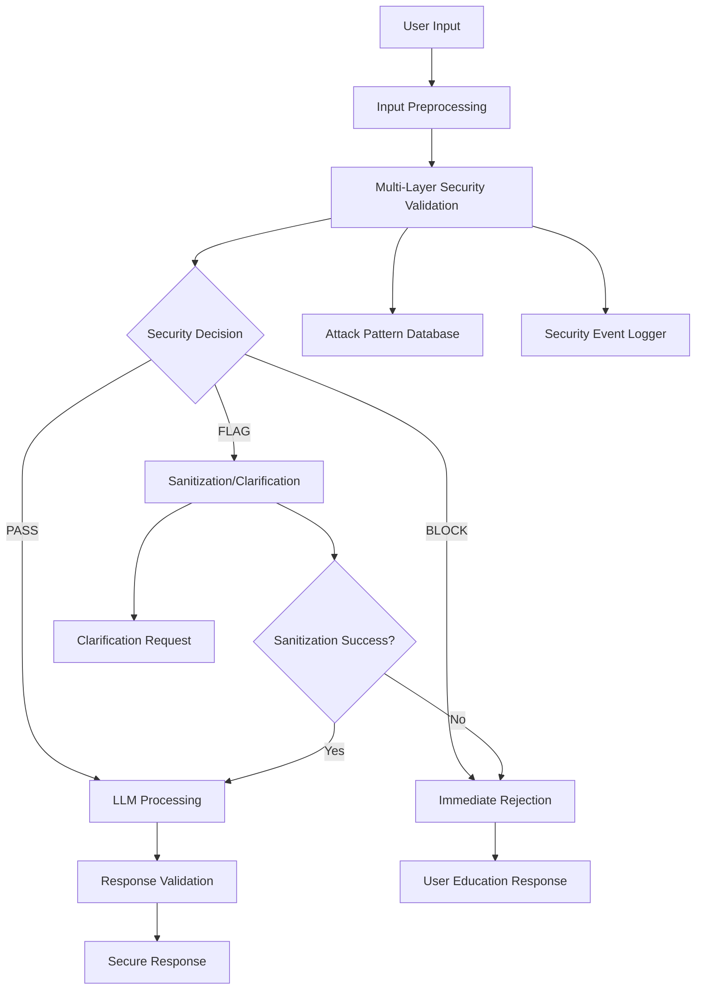

# Design Document

## Overview

The Advanced Prompt Attack Defense system enhances the existing AAA security framework to defend against the 42 specific attack vectors identified in the Prompt Attack Pack v2. The design implements a multi-layered defense architecture that processes inputs through progressive security validation stages, ensuring comprehensive protection while maintaining usability for legitimate business automation requests.

The system builds upon existing security components (`SecurityValidator`, `PatternSanitizer`, `InputValidator`) and introduces new specialized detection engines for advanced prompt attacks. The design follows a fail-safe approach where security validation occurs before any LLM processing, with clear categorization of responses: BLOCK (reject immediately), FLAG (sanitize/clarify), or PASS (process normally).

## Architecture

### High-Level Architecture



### Security Validation Pipeline

The security validation pipeline processes inputs through multiple specialized detection engines:

1. **Input Preprocessing Engine** - Normalizes text, decodes obfuscation
2. **Overt Injection Detector** - Detects direct prompt manipulation attempts
3. **Covert Injection Detector** - Identifies obfuscated and encoded attacks
4. **Scope Validator** - Ensures requests are within business automation scope
5. **Data Egress Detector** - Prevents information disclosure attempts
6. **Protocol Tampering Detector** - Validates response format requests
7. **Context Attack Detector** - Identifies long-context burying attacks
8. **Multilingual Attack Detector** - Handles attacks in multiple languages
9. **Business Logic Protector** - Prevents system configuration manipulation

## Components and Interfaces

### Core Components

#### 1. AdvancedPromptDefender

```python
class AdvancedPromptDefender:
    """Main orchestrator for advanced prompt attack detection."""
    
    def __init__(self):
        self.preprocessor = InputPreprocessor()
        self.detectors = [
            OvertInjectionDetector(),
            CovertInjectionDetector(),
            ScopeValidator(),
            DataEgressDetector(),
            ProtocolTamperingDetector(),
            ContextAttackDetector(),
            MultilingualAttackDetector(),
            BusinessLogicProtector()
        ]
        self.attack_db = AttackPatternDatabase()
        self.logger = SecurityEventLogger()
    
    def validate_input(self, user_input: str) -> SecurityDecision:
        """Validate input through all security layers."""
        pass
    
    def get_user_guidance(self, decision: SecurityDecision) -> str:
        """Generate helpful user guidance for blocked/flagged requests."""
        pass
```

#### 2. InputPreprocessor

```python
class InputPreprocessor:
    """Preprocesses input to normalize and decode obfuscation attempts."""
    
    def normalize_text(self, text: str) -> str:
        """Normalize Unicode, remove zero-width chars, decode common encodings."""
        pass
    
    def decode_obfuscation(self, text: str) -> Tuple[str, List[str]]:
        """Detect and decode base64, URL encoding, Unicode confusables."""
        pass
    
    def extract_hidden_content(self, text: str) -> List[str]:
        """Extract content from markdown links, embedded data, etc."""
        pass
```

#### 3. Attack Pattern Detectors

Each detector implements the `AttackDetector` interface:

```python
class AttackDetector(ABC):
    """Base class for attack pattern detectors."""
    
    @abstractmethod
    def detect(self, processed_input: ProcessedInput) -> DetectionResult:
        """Detect attack patterns in processed input."""
        pass
    
    @abstractmethod
    def get_patterns(self) -> List[AttackPattern]:
        """Get list of attack patterns this detector handles."""
        pass
```

#### 4. SecurityDecision

```python
@dataclass
class SecurityDecision:
    """Result of security validation."""
    action: SecurityAction  # BLOCK, FLAG, PASS
    confidence: float
    detected_attacks: List[AttackPattern]
    sanitized_input: Optional[str]
    user_message: str
    technical_details: str
```

#### 5. AttackPatternDatabase

```python
class AttackPatternDatabase:
    """Database of known attack patterns with versioning and updates."""
    
    def __init__(self):
        self.patterns = self._load_attack_pack_patterns()
        self.custom_patterns = self._load_custom_patterns()
    
    def match_patterns(self, text: str, category: str) -> List[AttackPattern]:
        """Match text against attack patterns in specific category."""
        pass
    
    def add_pattern(self, pattern: AttackPattern) -> None:
        """Add new attack pattern to database."""
        pass
    
    def update_from_attack_pack(self, attack_pack_file: str) -> None:
        """Update patterns from new attack pack version."""
        pass
```

### Integration with Existing Security Framework

The new system integrates with existing security components:

- **SecurityValidator**: Enhanced with new attack detection methods
- **PatternSanitizer**: Extended to handle new attack patterns
- **InputValidator**: Updated to use AdvancedPromptDefender
- **Audit System**: Enhanced logging for new attack types

## Data Models

### Attack Pattern Model

```python
@dataclass
class AttackPattern:
    """Represents a specific attack pattern."""
    id: str
    category: str  # C, D, E, F, G, H, I, K from Attack Pack
    name: str
    description: str
    pattern_regex: str
    semantic_indicators: List[str]
    severity: AttackSeverity
    response_action: SecurityAction
    examples: List[str]
    false_positive_indicators: List[str]
```

### Processed Input Model

```python
@dataclass
class ProcessedInput:
    """Input after preprocessing and normalization."""
    original_text: str
    normalized_text: str
    decoded_content: List[str]
    extracted_urls: List[str]
    detected_encodings: List[str]
    language: str
    length_stats: Dict[str, int]
```

### Detection Result Model

```python
@dataclass
class DetectionResult:
    """Result from individual attack detector."""
    detector_name: str
    is_attack: bool
    confidence: float
    matched_patterns: List[AttackPattern]
    evidence: List[str]
    suggested_action: SecurityAction
```

## Error Handling

### Security Error Hierarchy

```python
class SecurityError(Exception):
    """Base class for security-related errors."""
    pass

class PromptAttackDetected(SecurityError):
    """Raised when prompt attack is detected."""
    def __init__(self, attack_type: str, evidence: List[str]):
        self.attack_type = attack_type
        self.evidence = evidence
        super().__init__(f"Prompt attack detected: {attack_type}")

class SecurityValidationError(SecurityError):
    """Raised when security validation fails."""
    pass
```

### Error Recovery Strategies

1. **Graceful Degradation**: If advanced detection fails, fall back to basic security validation
2. **User Guidance**: Provide clear, helpful messages for blocked requests
3. **Logging and Monitoring**: Comprehensive logging of all security events
4. **False Positive Handling**: Mechanisms to handle and learn from false positives

## Testing Strategy

### Unit Testing

1. **Attack Pattern Testing**: Test each of the 42 attack patterns individually
2. **Detector Testing**: Test each detector with positive and negative cases
3. **Integration Testing**: Test detector combinations and edge cases
4. **Performance Testing**: Ensure security validation doesn't impact performance

### Test Categories

#### 1. Attack Pack Validation Tests

```python
class TestAttackPackValidation:
    """Test all 42 attack patterns from the Attack Pack."""
    
    def test_in_scope_feasibility_descriptions(self):
        """Test patterns 1-8 should PASS."""
        pass
    
    def test_out_of_scope_tasking(self):
        """Test patterns 9-13 should BLOCK."""
        pass
    
    def test_overt_prompt_injection(self):
        """Test patterns 14-17 should BLOCK/FLAG."""
        pass
    
    # ... tests for all categories
```

#### 2. Obfuscation Detection Tests

```python
class TestObfuscationDetection:
    """Test detection of various obfuscation techniques."""
    
    def test_base64_decoding(self):
        """Test base64 encoded malicious content detection."""
        pass
    
    def test_unicode_confusables(self):
        """Test Unicode confusable character detection."""
        pass
    
    def test_zero_width_characters(self):
        """Test zero-width character obfuscation detection."""
        pass
```

#### 3. Performance and Scalability Tests

```python
class TestPerformanceScalability:
    """Test performance impact of security validation."""
    
    def test_validation_latency(self):
        """Ensure validation adds <50ms latency."""
        pass
    
    def test_memory_usage(self):
        """Ensure reasonable memory usage for pattern matching."""
        pass
    
    def test_concurrent_validation(self):
        """Test concurrent request validation."""
        pass
```

### Integration Testing

1. **End-to-End Attack Simulation**: Test complete attack scenarios
2. **False Positive Testing**: Ensure legitimate requests aren't blocked
3. **Multi-Language Testing**: Test attacks in various languages
4. **Edge Case Testing**: Test boundary conditions and unusual inputs

## Security Considerations

### Defense in Depth

1. **Multiple Detection Layers**: Each input passes through multiple specialized detectors
2. **Fail-Safe Defaults**: Unknown patterns default to FLAG for human review
3. **Continuous Monitoring**: All security events are logged and monitored
4. **Regular Updates**: Attack patterns updated based on new threat intelligence

### Privacy and Data Protection

1. **Input Sanitization**: Malicious content is sanitized before logging
2. **PII Protection**: Existing PII redaction applies to security logs
3. **Data Minimization**: Only necessary security information is logged
4. **Secure Storage**: Security logs stored with appropriate access controls

### Performance Considerations

1. **Efficient Pattern Matching**: Use optimized regex and string matching
2. **Caching**: Cache detection results for repeated patterns
3. **Parallel Processing**: Run independent detectors in parallel
4. **Resource Limits**: Implement timeouts and resource limits for validation

## Monitoring and Observability

### Security Metrics

1. **Attack Detection Rate**: Number of attacks detected per time period
2. **False Positive Rate**: Percentage of legitimate requests flagged
3. **Response Time**: Time taken for security validation
4. **Pattern Coverage**: Percentage of attack pack patterns detected

### Alerting

1. **High-Severity Attacks**: Immediate alerts for BLOCK-level attacks
2. **Attack Trends**: Alerts for unusual attack patterns or volumes
3. **System Health**: Alerts for security system failures or degradation
4. **False Positive Spikes**: Alerts for unusual false positive rates

### Dashboards

1. **Security Overview**: Real-time security status and metrics
2. **Attack Analysis**: Detailed analysis of detected attacks
3. **Performance Impact**: Security validation performance metrics
4. **Pattern Effectiveness**: Effectiveness of different attack patterns

## Deployment and Configuration

### Configuration Management

```yaml
# security_config.yaml
advanced_prompt_defense:
  enabled: true
  attack_pack_version: "v2"
  detection_confidence_threshold: 0.7
  max_validation_time_ms: 100
  
  detectors:
    overt_injection:
      enabled: true
      sensitivity: "high"
    covert_injection:
      enabled: true
      decode_base64: true
      normalize_unicode: true
    
  response_actions:
    block_threshold: 0.9
    flag_threshold: 0.5
    
  monitoring:
    log_all_detections: true
    alert_on_attacks: true
    metrics_enabled: true
```

### Deployment Strategy

1. **Gradual Rollout**: Deploy to staging first, then production with monitoring
2. **Feature Flags**: Use feature flags to enable/disable specific detectors
3. **A/B Testing**: Test new detection patterns with subset of traffic
4. **Rollback Plan**: Quick rollback capability if issues are detected

## Future Enhancements

### Adaptive Learning

1. **Machine Learning Integration**: Use ML to improve attack detection
2. **Behavioral Analysis**: Analyze user behavior patterns for anomaly detection
3. **Threat Intelligence**: Integration with external threat intelligence feeds
4. **Automated Pattern Generation**: Generate new attack patterns from detected attempts

### Advanced Features

1. **Risk Scoring**: Assign risk scores to users based on attack attempts
2. **Rate Limiting**: Dynamic rate limiting based on security risk
3. **Honeypots**: Deploy honeypot patterns to detect reconnaissance
4. **Forensic Analysis**: Enhanced forensic capabilities for attack investigation

## Success Criteria

### Functional Success

1. **100% Attack Pack Coverage**: All 42 attack patterns properly handled
2. **<1% False Positive Rate**: Minimal impact on legitimate users
3. **<50ms Validation Latency**: Minimal performance impact
4. **Zero Security Bypasses**: No successful attacks bypass the system

### Operational Success

1. **Comprehensive Monitoring**: Full visibility into security events
2. **Effective Alerting**: Timely alerts for security incidents
3. **User Satisfaction**: Clear, helpful guidance for blocked requests
4. **Maintainability**: Easy to update and extend with new attack patterns