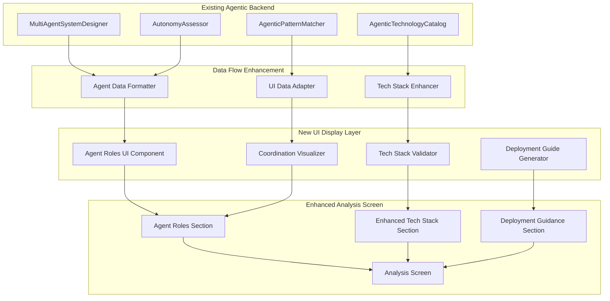
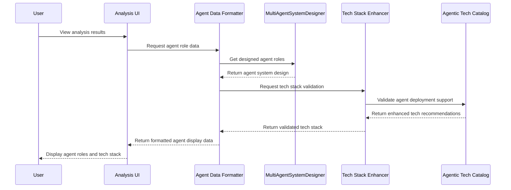

# Design Document

## Overview

This design extends the existing AAA system to display agentic agent roles in the Analysis screen UI and ensure tech stack recommendations support agent deployment. The system will bridge the gap between backend multi-agent system design (already implemented in the true-agentic-ai-transformation spec) and frontend user visibility. When agentic solutions are recommended, users will see detailed agent role information, understand coordination patterns, and receive tech stack recommendations that explicitly support agent deployment and management.

## Architecture

### High-Level Architecture Integration



### Data Flow for Agent Role Display



## Components and Interfaces

### Agent Data Formatter (`app/ui/agent_formatter.py`)

```python
from dataclasses import dataclass
from typing import List, Dict, Any, Optional
from app.services.multi_agent_designer import MultiAgentSystemDesign, AgentRole
from app.services.agentic_technology_catalog import AgenticTechnologyCatalog

@dataclass
class AgentRoleDisplay:
    """Formatted agent role data for UI display."""
    name: str
    responsibility: str
    autonomy_level: float
    autonomy_description: str  # Human-readable autonomy explanation
    capabilities: List[str]
    decision_authority: Dict[str, Any]
    decision_boundaries: List[str]  # Human-readable decision boundaries
    learning_capabilities: List[str]
    exception_handling: str
    communication_requirements: List[str]
    performance_metrics: List[str]
    infrastructure_requirements: Dict[str, Any]
    security_requirements: List[str]
    
@dataclass
class AgentCoordinationDisplay:
    """Formatted coordination data for UI display."""
    architecture_type: str
    architecture_description: str
    communication_protocols: List[Dict[str, str]]
    coordination_mechanisms: List[Dict[str, str]]
    interaction_patterns: List[Dict[str, Any]]
    conflict_resolution: str
    workflow_distribution: Dict[str, Any]
    
@dataclass
class AgentSystemDisplay:
    """Complete agent system display data."""
    has_agents: bool
    system_autonomy_score: float
    agent_roles: List[AgentRoleDisplay]
    coordination: Optional[AgentCoordinationDisplay]
    deployment_requirements: Dict[str, Any]
    tech_stack_validation: Dict[str, Any]
    implementation_guidance: List[Dict[str, str]]

class AgentDataFormatter:
    """Formats agent system design data for UI display."""
    
    def __init__(self, tech_catalog: AgenticTechnologyCatalog):
        self.tech_catalog = tech_catalog
        self.autonomy_descriptions = {
            (0.9, 1.0): "Fully Autonomous - Operates independently with minimal oversight",
            (0.7, 0.9): "Highly Autonomous - Makes most decisions independently",
            (0.5, 0.7): "Semi-Autonomous - Requires periodic human guidance",
            (0.3, 0.5): "Assisted - Significant human oversight required",
            (0.0, 0.3): "Manual - Primarily human-driven with AI assistance"
        }
    
    def format_agent_system(self, 
                           agent_design: Optional[MultiAgentSystemDesign],
                           tech_stack: List[str],
                           session_data: Dict[str, Any]) -> AgentSystemDisplay:
        """Format complete agent system for UI display."""
        
        if not agent_design:
            return AgentSystemDisplay(
                has_agents=False,
                system_autonomy_score=0.0,
                agent_roles=[],
                coordination=None,
                deployment_requirements={},
                tech_stack_validation={},
                implementation_guidance=[]
            )
        
        # Format individual agent roles
        formatted_roles = [
            self._format_agent_role(role) for role in agent_design.agent_roles
        ]
        
        # Format coordination information
        coordination = self._format_coordination(agent_design)
        
        # Validate and enhance tech stack for agent deployment
        tech_validation = self._validate_tech_stack_for_agents(
            tech_stack, agent_design
        )
        
        # Generate deployment requirements
        deployment_reqs = self._generate_deployment_requirements(agent_design)
        
        # Create implementation guidance
        implementation_guide = self._generate_implementation_guidance(
            agent_design, tech_validation
        )
        
        return AgentSystemDisplay(
            has_agents=True,
            system_autonomy_score=agent_design.autonomy_score,
            agent_roles=formatted_roles,
            coordination=coordination,
            deployment_requirements=deployment_reqs,
            tech_stack_validation=tech_validation,
            implementation_guidance=implementation_guide
        )
    
    def _format_agent_role(self, role: AgentRole) -> AgentRoleDisplay:
        """Format individual agent role for display."""
        
        # Get human-readable autonomy description
        autonomy_desc = self._get_autonomy_description(role.autonomy_level)
        
        # Format decision boundaries
        decision_boundaries = self._format_decision_boundaries(role.decision_authority)
        
        # Extract communication requirements
        comm_requirements = self._extract_communication_requirements(role.interfaces)
        
        # Generate performance metrics
        performance_metrics = self._generate_performance_metrics(role)
        
        # Determine infrastructure requirements
        infra_requirements = self._determine_infrastructure_requirements(role)
        
        # Extract security requirements
        security_requirements = self._extract_security_requirements(role)
        
        return AgentRoleDisplay(
            name=role.name,
            responsibility=role.responsibility,
            autonomy_level=role.autonomy_level,
            autonomy_description=autonomy_desc,
            capabilities=role.capabilities,
            decision_authority=role.decision_authority,
            decision_boundaries=decision_boundaries,
            learning_capabilities=role.learning_capabilities,
            exception_handling=role.exception_handling,
            communication_requirements=comm_requirements,
            performance_metrics=performance_metrics,
            infrastructure_requirements=infra_requirements,
            security_requirements=security_requirements
        )
    
    def _validate_tech_stack_for_agents(self, 
                                      tech_stack: List[str],
                                      agent_design: MultiAgentSystemDesign) -> Dict[str, Any]:
        """Validate and enhance tech stack for agent deployment."""
        
        validation_result = {
            "is_agent_ready": False,
            "missing_components": [],
            "recommended_additions": [],
            "deployment_frameworks": [],
            "orchestration_tools": [],
            "monitoring_tools": [],
            "reasoning_engines": []
        }
        
        # Check for agent deployment frameworks
        agent_frameworks = ["LangChain", "AutoGPT", "CrewAI", "Microsoft Semantic Kernel"]
        found_frameworks = [fw for fw in agent_frameworks if fw in tech_stack]
        
        if not found_frameworks:
            validation_result["missing_components"].append("Agent Deployment Framework")
            validation_result["recommended_additions"].extend([
                "LangChain - For flexible agent orchestration",
                "CrewAI - For multi-agent collaboration"
            ])
        else:
            validation_result["deployment_frameworks"] = found_frameworks
        
        # Check for orchestration tools (multi-agent systems)
        if len(agent_design.agent_roles) > 1:
            orchestration_tools = ["Apache Airflow", "Celery", "Redis", "RabbitMQ"]
            found_orchestration = [tool for tool in orchestration_tools if tool in tech_stack]
            
            if not found_orchestration:
                validation_result["missing_components"].append("Agent Orchestration")
                validation_result["recommended_additions"].extend([
                    "Redis - For agent communication and state management",
                    "Celery - For distributed agent task execution"
                ])
            else:
                validation_result["orchestration_tools"] = found_orchestration
        
        # Check for reasoning engines
        reasoning_engines = ["Neo4j", "Elasticsearch", "Pinecone", "Weaviate"]
        found_reasoning = [engine for engine in reasoning_engines if engine in tech_stack]
        
        if not found_reasoning:
            validation_result["recommended_additions"].extend([
                "Neo4j - For knowledge graph reasoning",
                "Pinecone - For vector-based reasoning and memory"
            ])
        else:
            validation_result["reasoning_engines"] = found_reasoning
        
        # Check for monitoring tools
        monitoring_tools = ["Prometheus", "Grafana", "DataDog", "New Relic"]
        found_monitoring = [tool for tool in monitoring_tools if tool in tech_stack]
        
        if not found_monitoring:
            validation_result["recommended_additions"].extend([
                "Prometheus - For agent performance monitoring",
                "Grafana - For agent analytics dashboards"
            ])
        else:
            validation_result["monitoring_tools"] = found_monitoring
        
        # Determine if tech stack is agent-ready
        validation_result["is_agent_ready"] = (
            len(found_frameworks) > 0 and
            (len(agent_design.agent_roles) == 1 or len(found_orchestration) > 0)
        )
        
        return validation_result
```

### Enhanced Analysis UI Component (`app/ui/analysis_display.py`)

```python
import streamlit as st
from typing import Dict, Any, List
from app.ui.agent_formatter import AgentSystemDisplay, AgentRoleDisplay

class AgentRolesUIComponent:
    """UI component for displaying agent roles and coordination."""
    
    def render_agent_system(self, agent_system: AgentSystemDisplay):
        """Render complete agent system display."""
        
        if not agent_system.has_agents:
            return
        
        st.header("🤖 Agentic Solution Design")
        
        # System overview
        self._render_system_overview(agent_system)
        
        # Agent roles
        self._render_agent_roles(agent_system.agent_roles)
        
        # Coordination (if multi-agent)
        if agent_system.coordination:
            self._render_coordination(agent_system.coordination)
        
        # Tech stack validation
        self._render_tech_stack_validation(agent_system.tech_stack_validation)
        
        # Deployment guidance
        self._render_deployment_guidance(
            agent_system.deployment_requirements,
            agent_system.implementation_guidance
        )
    
    def _render_system_overview(self, agent_system: AgentSystemDisplay):
        """Render system-level overview."""
        
        col1, col2, col3 = st.columns(3)
        
        with col1:
            st.metric(
                "System Autonomy Score",
                f"{agent_system.system_autonomy_score:.1f}",
                help="Overall autonomy level of the agent system (0.0-1.0)"
            )
        
        with col2:
            st.metric(
                "Number of Agents",
                len(agent_system.agent_roles),
                help="Total number of specialized agents in the system"
            )
        
        with col3:
            architecture_type = agent_system.coordination.architecture_type if agent_system.coordination else "Single Agent"
            st.metric(
                "Architecture",
                architecture_type.replace("_", " ").title(),
                help="Agent system architecture pattern"
            )
    
    def _render_agent_roles(self, agent_roles: List[AgentRoleDisplay]):
        """Render individual agent roles."""
        
        st.subheader("Agent Roles & Responsibilities")
        
        # Create tabs for different views
        tab1, tab2, tab3 = st.tabs(["Overview", "Capabilities", "Operations"])
        
        with tab1:
            self._render_agent_overview(agent_roles)
        
        with tab2:
            self._render_agent_capabilities(agent_roles)
        
        with tab3:
            self._render_agent_operations(agent_roles)
    
    def _render_agent_overview(self, agent_roles: List[AgentRoleDisplay]):
        """Render agent overview information."""
        
        for i, agent in enumerate(agent_roles):
            with st.expander(f"🤖 {agent.name} (Autonomy: {agent.autonomy_level:.1f})", expanded=i==0):
                
                col1, col2 = st.columns([2, 1])
                
                with col1:
                    st.write("**Primary Responsibility:**")
                    st.write(agent.responsibility)
                    
                    st.write("**Autonomy Level:**")
                    st.write(f"{agent.autonomy_description} ({agent.autonomy_level:.1f})")
                
                with col2:
                    # Autonomy level visualization
                    autonomy_color = self._get_autonomy_color(agent.autonomy_level)
                    st.markdown(f"""
                    <div style="
                        background: linear-gradient(90deg, {autonomy_color} {agent.autonomy_level*100}%, #f0f0f0 {agent.autonomy_level*100}%);
                        height: 20px;
                        border-radius: 10px;
                        margin: 10px 0;
                    "></div>
                    """, unsafe_allow_html=True)
                
                # Decision boundaries
                if agent.decision_boundaries:
                    st.write("**Decision Boundaries:**")
                    for boundary in agent.decision_boundaries:
                        st.write(f"• {boundary}")
    
    def _render_agent_capabilities(self, agent_roles: List[AgentRoleDisplay]):
        """Render agent capabilities and learning mechanisms."""
        
        for agent in agent_roles:
            with st.expander(f"⚙️ {agent.name} - Capabilities"):
                
                col1, col2 = st.columns(2)
                
                with col1:
                    st.write("**Core Capabilities:**")
                    for capability in agent.capabilities:
                        st.write(f"• {capability}")
                    
                    st.write("**Learning Capabilities:**")
                    for learning in agent.learning_capabilities:
                        st.write(f"• {learning}")
                
                with col2:
                    st.write("**Exception Handling:**")
                    st.write(agent.exception_handling)
                    
                    st.write("**Performance Metrics:**")
                    for metric in agent.performance_metrics:
                        st.write(f"• {metric}")
    
    def _render_agent_operations(self, agent_roles: List[AgentRoleDisplay]):
        """Render operational requirements and infrastructure."""
        
        for agent in agent_roles:
            with st.expander(f"🔧 {agent.name} - Operations"):
                
                col1, col2 = st.columns(2)
                
                with col1:
                    st.write("**Infrastructure Requirements:**")
                    for key, value in agent.infrastructure_requirements.items():
                        st.write(f"• **{key.replace('_', ' ').title()}:** {value}")
                    
                    st.write("**Communication Requirements:**")
                    for comm in agent.communication_requirements:
                        st.write(f"• {comm}")
                
                with col2:
                    st.write("**Security Requirements:**")
                    for security in agent.security_requirements:
                        st.write(f"• {security}")
    
    def _render_tech_stack_validation(self, validation: Dict[str, Any]):
        """Render tech stack validation for agent deployment."""
        
        st.subheader("🛠️ Tech Stack Validation for Agent Deployment")
        
        # Agent readiness status
        if validation["is_agent_ready"]:
            st.success("✅ Tech stack is ready for agent deployment")
        else:
            st.warning("⚠️ Tech stack needs enhancements for agent deployment")
        
        col1, col2 = st.columns(2)
        
        with col1:
            if validation["deployment_frameworks"]:
                st.write("**Available Agent Frameworks:**")
                for framework in validation["deployment_frameworks"]:
                    st.write(f"✅ {framework}")
            
            if validation["orchestration_tools"]:
                st.write("**Available Orchestration Tools:**")
                for tool in validation["orchestration_tools"]:
                    st.write(f"✅ {tool}")
        
        with col2:
            if validation["missing_components"]:
                st.write("**Missing Components:**")
                for component in validation["missing_components"]:
                    st.write(f"❌ {component}")
            
            if validation["recommended_additions"]:
                st.write("**Recommended Additions:**")
                for addition in validation["recommended_additions"]:
                    st.write(f"➕ {addition}")
    
    def _get_autonomy_color(self, autonomy_level: float) -> str:
        """Get color for autonomy level visualization."""
        if autonomy_level >= 0.9:
            return "#00ff00"  # Green
        elif autonomy_level >= 0.7:
            return "#90ee90"  # Light green
        elif autonomy_level >= 0.5:
            return "#ffff00"  # Yellow
        elif autonomy_level >= 0.3:
            return "#ffa500"  # Orange
        else:
            return "#ff0000"  # Red
```

### Tech Stack Enhancer (`app/services/tech_stack_enhancer.py`)

```python
from typing import List, Dict, Any
from app.services.multi_agent_designer import MultiAgentSystemDesign
from app.services.agentic_technology_catalog import AgenticTechnologyCatalog

class TechStackEnhancer:
    """Enhances tech stack recommendations to support agent deployment."""
    
    def __init__(self, tech_catalog: AgenticTechnologyCatalog):
        self.tech_catalog = tech_catalog
        
        # Agent deployment requirements mapping
        self.agent_requirements = {
            "single_agent": {
                "required": ["agent_framework", "llm_provider", "vector_database"],
                "optional": ["monitoring", "logging"]
            },
            "multi_agent": {
                "required": ["agent_framework", "orchestration", "communication", "state_management"],
                "optional": ["load_balancer", "monitoring", "logging"]
            },
            "hierarchical": {
                "required": ["agent_framework", "workflow_engine", "state_management", "monitoring"],
                "optional": ["message_queue", "service_mesh"]
            }
        }
    
    def enhance_tech_stack_for_agents(self, 
                                    base_tech_stack: List[str],
                                    agent_design: MultiAgentSystemDesign) -> Dict[str, Any]:
        """Enhance tech stack to support agent deployment."""
        
        architecture = agent_design.architecture_type
        requirements = self.agent_requirements.get(architecture, self.agent_requirements["single_agent"])
        
        enhanced_stack = {
            "base_technologies": base_tech_stack,
            "agent_enhancements": [],
            "deployment_additions": [],
            "monitoring_additions": [],
            "integration_requirements": [],
            "deployment_ready": False
        }
        
        # Add agent framework if missing
        agent_frameworks = self._find_agent_frameworks(base_tech_stack)
        if not agent_frameworks:
            enhanced_stack["agent_enhancements"].extend([
                {
                    "technology": "LangChain",
                    "category": "Agent Framework",
                    "reason": "Flexible agent orchestration and tool integration",
                    "priority": "high"
                },
                {
                    "technology": "CrewAI", 
                    "category": "Multi-Agent Framework",
                    "reason": "Specialized for multi-agent collaboration",
                    "priority": "medium"
                }
            ])
        
        # Add orchestration for multi-agent systems
        if len(agent_design.agent_roles) > 1:
            orchestration_tools = self._find_orchestration_tools(base_tech_stack)
            if not orchestration_tools:
                enhanced_stack["deployment_additions"].extend([
                    {
                        "technology": "Redis",
                        "category": "State Management",
                        "reason": "Agent state synchronization and communication",
                        "priority": "high"
                    },
                    {
                        "technology": "Celery",
                        "category": "Task Queue",
                        "reason": "Distributed agent task execution",
                        "priority": "medium"
                    }
                ])
        
        # Add reasoning and memory systems
        reasoning_engines = self._find_reasoning_engines(base_tech_stack)
        if not reasoning_engines:
            enhanced_stack["agent_enhancements"].extend([
                {
                    "technology": "Pinecone",
                    "category": "Vector Database",
                    "reason": "Agent memory and reasoning capabilities",
                    "priority": "high"
                },
                {
                    "technology": "Neo4j",
                    "category": "Knowledge Graph",
                    "reason": "Complex reasoning and relationship modeling",
                    "priority": "medium"
                }
            ])
        
        # Add monitoring for agent systems
        monitoring_tools = self._find_monitoring_tools(base_tech_stack)
        if not monitoring_tools:
            enhanced_stack["monitoring_additions"].extend([
                {
                    "technology": "Prometheus",
                    "category": "Metrics Collection",
                    "reason": "Agent performance and health monitoring",
                    "priority": "high"
                },
                {
                    "technology": "Grafana",
                    "category": "Visualization",
                    "reason": "Agent analytics and operational dashboards",
                    "priority": "medium"
                }
            ])
        
        # Add integration requirements based on agent capabilities
        enhanced_stack["integration_requirements"] = self._determine_integration_requirements(
            agent_design
        )
        
        # Determine if deployment ready
        enhanced_stack["deployment_ready"] = self._assess_deployment_readiness(
            base_tech_stack, enhanced_stack
        )
        
        return enhanced_stack
    
    def _find_agent_frameworks(self, tech_stack: List[str]) -> List[str]:
        """Find agent frameworks in tech stack."""
        agent_frameworks = ["LangChain", "AutoGPT", "CrewAI", "Microsoft Semantic Kernel"]
        return [fw for fw in agent_frameworks if fw in tech_stack]
    
    def _determine_integration_requirements(self, 
                                         agent_design: MultiAgentSystemDesign) -> List[Dict[str, str]]:
        """Determine integration requirements based on agent capabilities."""
        
        integrations = []
        
        # Check for external API requirements
        for agent in agent_design.agent_roles:
            if "api_integration" in agent.capabilities:
                integrations.append({
                    "type": "API Gateway",
                    "reason": f"{agent.name} requires external API access",
                    "technologies": ["Kong", "AWS API Gateway", "Nginx"]
                })
            
            if "database_access" in agent.capabilities:
                integrations.append({
                    "type": "Database Connection Pool",
                    "reason": f"{agent.name} requires database access",
                    "technologies": ["SQLAlchemy", "Connection Pooling"]
                })
            
            if "file_processing" in agent.capabilities:
                integrations.append({
                    "type": "File Storage",
                    "reason": f"{agent.name} processes files",
                    "technologies": ["AWS S3", "MinIO", "Local Storage"]
                })
        
        return integrations
```

## Data Models

### Agent Display Models

```python
from dataclasses import dataclass
from typing import List, Dict, Any, Optional
from enum import Enum

class AutonomyLevel(Enum):
    MANUAL = (0.0, 0.3, "Manual", "Primarily human-driven with AI assistance")
    ASSISTED = (0.3, 0.5, "Assisted", "Significant human oversight required")
    SEMI_AUTONOMOUS = (0.5, 0.7, "Semi-Autonomous", "Requires periodic human guidance")
    HIGHLY_AUTONOMOUS = (0.7, 0.9, "Highly Autonomous", "Makes most decisions independently")
    FULLY_AUTONOMOUS = (0.9, 1.0, "Fully Autonomous", "Operates independently with minimal oversight")

@dataclass
class AgentCapabilityDisplay:
    """Display model for agent capabilities."""
    name: str
    description: str
    autonomy_impact: float
    examples: List[str]

@dataclass
class AgentDecisionBoundary:
    """Display model for agent decision boundaries."""
    decision_type: str
    can_decide_autonomously: bool
    requires_approval: bool
    escalation_criteria: List[str]
    examples: List[str]

@dataclass
class AgentLearningMechanism:
    """Display model for agent learning capabilities."""
    mechanism_type: str
    description: str
    data_sources: List[str]
    improvement_areas: List[str]
    feedback_loops: List[str]

@dataclass
class AgentInfrastructureRequirement:
    """Display model for agent infrastructure needs."""
    component: str
    requirement_type: str  # required, recommended, optional
    specifications: Dict[str, Any]
    scaling_considerations: List[str]
    cost_implications: str

@dataclass
class TechStackValidationResult:
    """Result of tech stack validation for agent deployment."""
    is_deployment_ready: bool
    readiness_score: float  # 0.0-1.0
    missing_critical_components: List[str]
    missing_recommended_components: List[str]
    enhancement_suggestions: List[Dict[str, Any]]
    deployment_blockers: List[str]
    estimated_setup_time: str
```

## Error Handling

### Agent Display Error Handling

```python
class AgentDisplayErrorHandler:
    """Handle errors in agent display components."""
    
    def handle_agent_formatting_error(self, error: Exception, agent_data: Dict[str, Any]) -> AgentSystemDisplay:
        """Handle errors in agent data formatting."""
        
        app_logger.error(f"Agent formatting error: {error}")
        
        # Return safe fallback display
        return AgentSystemDisplay(
            has_agents=False,
            system_autonomy_score=0.0,
            agent_roles=[],
            coordination=None,
            deployment_requirements={},
            tech_stack_validation={"error": "Unable to format agent data"},
            implementation_guidance=[{
                "type": "error",
                "message": "Agent role information temporarily unavailable"
            }]
        )
    
    def handle_tech_validation_error(self, error: Exception, tech_stack: List[str]) -> Dict[str, Any]:
        """Handle errors in tech stack validation."""
        
        app_logger.error(f"Tech validation error: {error}")
        
        return {
            "is_agent_ready": False,
            "error": "Unable to validate tech stack for agent deployment",
            "fallback_recommendations": [
                "Consider LangChain for agent framework",
                "Add Redis for agent state management",
                "Include monitoring tools for agent observability"
            ]
        }
```

## Testing Strategy

### Agent Display Testing

```python
class TestAgentDisplayComponents:
    """Test agent display functionality."""
    
    async def test_agent_role_formatting(self):
        """Test agent role data formatting."""
        
        # Mock agent design
        mock_agent_design = MultiAgentSystemDesign(
            architecture_type="coordinator_based",
            agent_roles=[
                AgentRole(
                    name="Coordinator Agent",
                    responsibility="Orchestrate workflow and manage other agents",
                    autonomy_level=0.8,
                    capabilities=["workflow_management", "agent_coordination"],
                    decision_authority={"workflow_decisions": True, "resource_allocation": True}
                )
            ],
            autonomy_score=0.85
        )
        
        formatter = AgentDataFormatter(mock_tech_catalog)
        result = formatter.format_agent_system(mock_agent_design, ["LangChain", "Redis"], {})
        
        assert result.has_agents == True
        assert len(result.agent_roles) == 1
        assert result.agent_roles[0].name == "Coordinator Agent"
        assert result.agent_roles[0].autonomy_level == 0.8
    
    async def test_tech_stack_validation(self):
        """Test tech stack validation for agent deployment."""
        
        enhancer = TechStackEnhancer(mock_tech_catalog)
        
        # Test with minimal tech stack
        minimal_stack = ["Python", "FastAPI"]
        result = enhancer.enhance_tech_stack_for_agents(minimal_stack, mock_agent_design)
        
        assert result["deployment_ready"] == False
        assert len(result["agent_enhancements"]) > 0
        assert any("LangChain" in str(enhancement) for enhancement in result["agent_enhancements"])
    
    async def test_ui_component_rendering(self):
        """Test UI component rendering without errors."""
        
        ui_component = AgentRolesUIComponent()
        
        # Mock Streamlit environment
        with patch('streamlit.header'), patch('streamlit.subheader'), patch('streamlit.columns'):
            # Should not raise exceptions
            ui_component.render_agent_system(mock_agent_display)
```

## Performance Considerations

### Agent Display Performance

- **Lazy Loading**: Load agent details only when expanded in UI
- **Caching**: Cache formatted agent data to avoid recomputation
- **Pagination**: For systems with many agents, implement pagination
- **Progressive Enhancement**: Load basic info first, then detailed capabilities
- **Memoization**: Cache tech stack validation results for similar configurations

### UI Responsiveness

- **Async Loading**: Load agent data asynchronously to avoid blocking UI
- **Skeleton Loading**: Show loading placeholders while formatting agent data
- **Error Boundaries**: Graceful degradation when agent data is unavailable
- **Responsive Design**: Ensure agent displays work on different screen sizes
- **Performance Monitoring**: Track rendering times for agent display components