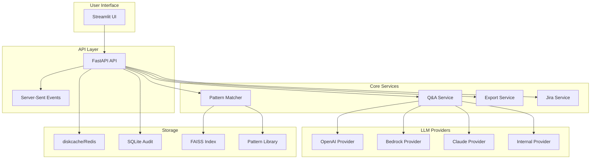

# Design Document

## Overview

Automated AI Assessment (AAA) is a microservices-based system built with FastAPI backend and Streamlit frontend. The architecture follows clean architecture principles with dependency injection, pluggable providers, and comprehensive observability. The system processes user requirements through a state machine workflow, leveraging vector embeddings and pattern matching to provide automation feasibility assessments.

## Architecture

### High-Level Architecture



### Request Flow

1. **Ingestion**: User submits requirements → API creates session_id → State machine begins
2. **Processing**: PARSING → VALIDATING → QNA → MATCHING → RECOMMENDING → DONE
3. **Q&A Loop**: Missing fields trigger questions → User responses update state → Continue when complete
4. **Matching**: Tag filtering + Vector similarity → Score blending → Constraint application
5. **Export**: Generate JSON/Markdown → Validate schema → Provide download URL

## Components and Interfaces

### Configuration Management (`app/config.py`)

```python
class Settings(BaseSettings):
    provider: str = "openai"
    model: str = "gpt-4o"
    pattern_library_path: Path = Path("./data/patterns")
    export_path: Path = Path("./exports")
    constraints: ConstraintsConfig = ConstraintsConfig()
    timeouts: TimeoutConfig = TimeoutConfig()
    logging: LoggingConfig = LoggingConfig()
    bedrock: BedrockConfig = BedrockConfig()
    
    class Config:
        env_file = ".env"
        yaml_file = "config.yaml"
```

### LLM Provider Interface (`app/llm/base.py`)

```python
class LLMProvider(ABC):
    @abstractmethod
    async def generate(self, prompt: str, **kwargs) -> str:
        pass
    
    @abstractmethod
    async def test_connection(self) -> bool:
        pass
    
    @abstractmethod
    def get_model_info(self) -> Dict[str, Any]:
        pass

class EmbeddingProvider(ABC):
    @abstractmethod
    async def embed(self, text: str) -> List[float]:
        pass
    
    @abstractmethod
    async def embed_batch(self, texts: List[str]) -> List[List[float]]:
        pass
```

### State Management (`app/state/store.py`)

```python
class SessionStore(ABC):
    @abstractmethod
    async def get_session(self, session_id: str) -> Optional[SessionState]:
        pass
    
    @abstractmethod
    async def update_session(self, session_id: str, state: SessionState) -> None:
        pass
    
    @abstractmethod
    async def delete_session(self, session_id: str) -> None:
        pass

@dataclass
class SessionState:
    session_id: str
    phase: Phase
    progress: int
    requirements: Dict[str, Any]
    missing_fields: List[str]
    qa_history: List[QAExchange]
    matches: List[PatternMatch]
    recommendations: List[Recommendation]
    created_at: datetime
    updated_at: datetime
```

### Pattern Matching (`app/pattern/matcher.py`)

```python
class PatternMatcher:
    def __init__(self, 
                 pattern_loader: PatternLoader,
                 embedding_provider: EmbeddingProvider,
                 faiss_index: FAISSIndex):
        self.pattern_loader = pattern_loader
        self.embedding_provider = embedding_provider
        self.faiss_index = faiss_index
    
    async def match_patterns(self, 
                           requirements: Dict[str, Any], 
                           top_k: int = 5) -> List[PatternMatch]:
        # 1. Fast tag filtering
        tag_candidates = await self._filter_by_tags(requirements)
        
        # 2. Vector similarity search
        embedding = await self.embedding_provider.embed(requirements["description"])
        vector_candidates = await self.faiss_index.search(embedding, top_k * 2)
        
        # 3. Score blending and ranking
        blended_scores = self._blend_scores(tag_candidates, vector_candidates)
        
        # 4. Apply constraints
        filtered_results = self._apply_constraints(blended_scores)
        
        return filtered_results[:top_k]
```

### Q&A System (`app/qa/question_loop.py`)

```python
class QuestionLoop:
    def __init__(self, 
                 llm_provider: LLMProvider,
                 template_loader: TemplateLoader,
                 session_store: SessionStore):
        self.llm_provider = llm_provider
        self.template_loader = template_loader
        self.session_store = session_store
    
    async def generate_questions(self, 
                               session_id: str, 
                               max_questions: int = 5) -> List[Question]:
        session = await self.session_store.get_session(session_id)
        missing_fields = self._identify_missing_fields(session.requirements)
        
        if not missing_fields or len(session.qa_history) >= max_questions:
            return []
        
        templates = await self.template_loader.get_templates_for_fields(missing_fields)
        questions = []
        
        for template in templates:
            question = await self._generate_question_from_template(template, session)
            questions.append(question)
        
        return questions
    
    async def process_answers(self, 
                            session_id: str, 
                            answers: Dict[str, str]) -> QAResult:
        session = await self.session_store.get_session(session_id)
        
        # Update requirements with answers
        updated_requirements = self._merge_answers(session.requirements, answers)
        
        # Check if we need more questions
        missing_fields = self._identify_missing_fields(updated_requirements)
        confidence = self._calculate_confidence(updated_requirements)
        
        # Update session state
        session.requirements = updated_requirements
        session.missing_fields = missing_fields
        session.qa_history.append(QAExchange(answers=answers, timestamp=datetime.now()))
        
        await self.session_store.update_session(session_id, session)
        
        return QAResult(
            complete=len(missing_fields) == 0 or confidence > 0.8,
            confidence=confidence,
            next_questions=await self.generate_questions(session_id) if not complete else []
        )
```

## Data Models

### Pattern Schema (`app/pattern/schema.json`)

```json
{
  "$schema": "https://json-schema.org/draft-07/schema#",
  "type": "object",
  "required": ["pattern_id", "name", "description", "feasibility", "pattern_type", "input_requirements", "tech_stack", "confidence_score"],
  "properties": {
    "pattern_id": {"type": "string", "pattern": "^PAT-[0-9]{3,}$"},
    "name": {"type": "string"},
    "description": {"type": "string"},
    "feasibility": {"enum": ["Automatable", "Partially Automatable", "Not Automatable"]},
    "pattern_type": {"type": "array", "items": {"type": "string"}},
    "input_requirements": {"type": "array", "items": {"type": "string"}},
    "tech_stack": {"type": "array", "items": {"type": "string"}},
    "related_patterns": {"type": "array", "items": {"type": "string"}},
    "confidence_score": {"type": "number", "minimum": 0, "maximum": 1},
    "constraints": {
      "type": "object",
      "properties": {
        "banned_tools": {"type": "array", "items": {"type": "string"}},
        "required_integrations": {"type": "array", "items": {"type": "string"}}
      }
    }
  }
}
```

### Session State Models

```python
@dataclass
class QAExchange:
    questions: List[str]
    answers: Dict[str, str]
    timestamp: datetime

@dataclass
class PatternMatch:
    pattern_id: str
    score: float
    rationale: str
    confidence: float

@dataclass
class Recommendation:
    pattern_id: str
    feasibility: str
    confidence: float
    tech_stack: List[str]
    reasoning: str

class Phase(Enum):
    PARSING = "PARSING"
    VALIDATING = "VALIDATING"
    QNA = "QNA"
    MATCHING = "MATCHING"
    RECOMMENDING = "RECOMMENDING"
    DONE = "DONE"
```

### Audit Models (`app/utils/audit.py`)

```python
class AuditRun(Base):
    __tablename__ = "runs"
    
    id = Column(Integer, primary_key=True)
    session_id = Column(String, nullable=False)
    provider = Column(String, nullable=False)
    model = Column(String, nullable=False)
    latency_ms = Column(Integer, nullable=False)
    tokens = Column(Integer, nullable=True)
    created_at = Column(DateTime, default=datetime.utcnow)

class AuditMatch(Base):
    __tablename__ = "matches"
    
    id = Column(Integer, primary_key=True)
    session_id = Column(String, nullable=False)
    pattern_id = Column(String, nullable=False)
    score = Column(Float, nullable=False)
    accepted = Column(Boolean, nullable=True)
    created_at = Column(DateTime, default=datetime.utcnow)
```

## Error Handling

### Custom Exceptions

```python
class AgenticOrNotError(Exception):
    """Base exception for all application errors"""
    pass

class ProviderError(AgenticOrNotError):
    """LLM provider related errors"""
    pass

class ProviderTimeout(ProviderError):
    """Provider request timeout"""
    pass

class PatternValidationError(AgenticOrNotError):
    """Pattern schema validation errors"""
    pass

class SessionNotFoundError(AgenticOrNotError):
    """Session state not found"""
    pass

class ConfigurationError(AgenticOrNotError):
    """Configuration loading/validation errors"""
    pass
```

### Error Response Format

```python
@dataclass
class ErrorResponse:
    error: str
    message: str
    details: Optional[Dict[str, Any]] = None
    timestamp: datetime = field(default_factory=datetime.now)
```

### Global Exception Handler

```python
@app.exception_handler(AgenticOrNotError)
async def handle_application_error(request: Request, exc: AgenticOrNotError):
    logger.error(f"Application error: {exc}", extra={"request_id": request.state.request_id})
    return JSONResponse(
        status_code=400,
        content=ErrorResponse(
            error=exc.__class__.__name__,
            message=str(exc)
        ).dict()
    )
```

## Testing Strategy

### Test Structure

```
app/tests/
├── unit/
│   ├── test_config.py           # Config loading, merging, redaction
│   ├── test_providers.py        # LLM provider implementations
│   ├── test_matcher.py          # Pattern matching logic
│   ├── test_qa_loop.py          # Question generation and processing
│   ├── test_exporters.py        # JSON/Markdown export validation
│   ├── test_jira.py             # Jira integration
│   └── test_utils.py            # Logging, redaction utilities
├── integration/
│   ├── test_api_routes.py       # FastAPI endpoint testing
│   ├── test_faiss_flow.py       # Vector search integration
│   └── test_state_store.py      # Session state persistence
├── e2e/
│   ├── test_streamlit_flow.py   # UI to API integration
│   └── test_provider_switch.py  # Live provider switching
└── fixtures/
    ├── patterns/                # Sample pattern data
    ├── requirements/            # Test requirement sets
    └── responses/               # Mock LLM responses
```

### Test Coverage Requirements

- **Unit Tests**: 100% statement and branch coverage
- **Integration Tests**: API contract validation, database operations
- **E2E Tests**: Complete user workflows, export validation
- **Property-Based Tests**: Using Hypothesis for edge cases

### Deterministic Fakes

```python
class FakeLLM(LLMProvider):
    def __init__(self, responses: Dict[str, str], seed: int = 42):
        self.responses = responses
        self.random = Random(seed)
    
    async def generate(self, prompt: str, **kwargs) -> str:
        # Deterministic response based on prompt hash
        prompt_hash = hashlib.md5(prompt.encode()).hexdigest()[:8]
        return self.responses.get(prompt_hash, "Default response")

class FakeEmbedder(EmbeddingProvider):
    def __init__(self, dimension: int = 384, seed: int = 42):
        self.dimension = dimension
        self.random = Random(seed)
    
    async def embed(self, text: str) -> List[float]:
        # Deterministic embedding based on text hash
        text_hash = hashlib.md5(text.encode()).hexdigest()
        self.random.seed(int(text_hash[:8], 16))
        return [self.random.gauss(0, 1) for _ in range(self.dimension)]
```

## Security Considerations

### PII Redaction

```python
class PIIRedactor:
    def __init__(self):
        self.patterns = {
            'email': re.compile(r'\b[A-Za-z0-9._%+-]+@[A-Za-z0-9.-]+\.[A-Z|a-z]{2,}\b'),
            'phone': re.compile(r'\b\d{3}-\d{3}-\d{4}\b'),
            'ssn': re.compile(r'\b\d{3}-\d{2}-\d{4}\b'),
            'api_key': re.compile(r'\b[A-Za-z0-9]{32,}\b')
        }
    
    def redact(self, text: str) -> str:
        for pattern_name, pattern in self.patterns.items():
            text = pattern.sub(f'[REDACTED_{pattern_name.upper()}]', text)
        return text
```

### Credential Management

- API keys loaded from environment variables only
- No persistence of credentials to disk or database
- Provider allowlist for outbound HTTP requests
- Secure headers and CORS configuration

## Performance Considerations

### Caching Strategy

- Pattern library cached in memory with TTL refresh
- FAISS index loaded once at startup
- Session state cached with configurable TTL
- LLM responses cached by prompt hash (optional)

### Async Processing

- All I/O operations use async/await
- Connection pooling for database and HTTP clients
- Background tasks for non-blocking operations
- Streaming responses for long-running operations

### Resource Management

- Connection limits for external APIs
- Request timeouts and circuit breakers
- Memory-efficient vector operations
- Graceful degradation on provider failures