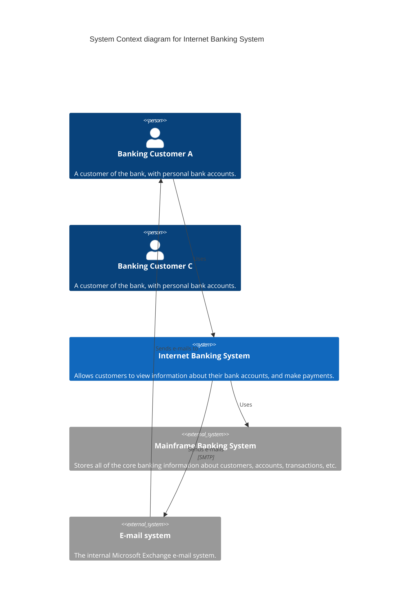
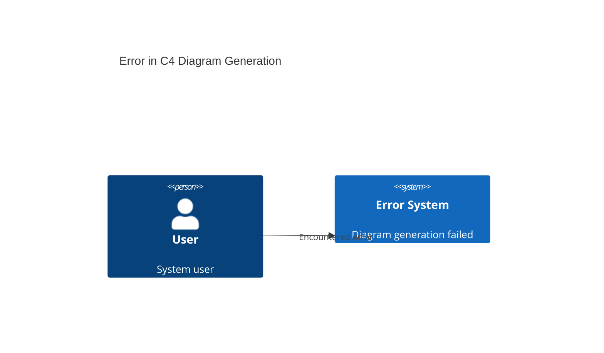

# Design Document

## Overview

This design implements proper C4 diagram support for the Automated AI Assessment (AAA) system using Mermaid's C4 syntax. The C4 model (Context, Containers, Components, Code) provides a hierarchical approach to software architecture diagrams. This implementation will add a new "C4 Diagram" option to the existing diagram menu and generate diagrams using proper C4 syntax instead of the current flowchart-based approach.

The design leverages Mermaid's native C4 diagram support (https://mermaid.js.org/syntax/c4.html) which provides specialized syntax for creating C4 model diagrams with proper styling, boundaries, and relationships.

## Architecture

### Current Diagram System
The existing system has the following diagram generation flow:
1. User selects diagram type from dropdown
2. System calls appropriate `build_*_diagram()` function
3. Function generates LLM prompt and calls `make_llm_request()`
4. Response is cleaned and validated using `_clean_mermaid_code()` and `_validate_mermaid_syntax()`
5. Diagram is stored in session state and rendered using streamlit-mermaid

### C4 Integration Approach
The C4 diagram support will integrate into this existing flow by:
1. Adding "C4 Diagram" to the diagram type selectbox
2. Creating a new `build_c4_diagram()` function following the same pattern
3. Extending validation functions to recognize C4 syntax
4. Using the same session state storage and rendering mechanisms

## Components and Interfaces

### 1. UI Components (streamlit_app.py)

#### Diagram Type Selection
- **Location**: Line ~2732 in diagram type selectbox
- **Change**: Add "C4 Diagram" to the options list
- **Description**: Add description explaining C4 diagrams vs existing Context/Container diagrams

#### Diagram Generation Logic
- **Location**: Line ~2787 conditional logic for diagram generation
- **Change**: Add elif branch for "C4 Diagram" type
- **Integration**: Call `build_c4_diagram()` function and store result in session state

### 2. C4 Diagram Builder Function

#### Function Signature
```python
async def build_c4_diagram(requirement: str, recommendations: List[Dict]) -> str:
    """Build a C4 diagram using LLM with proper Mermaid C4 syntax."""
```

#### LLM Prompt Design
The prompt will instruct the LLM to generate proper C4 syntax including:
- `C4Context` or `C4Container` diagram types
- Proper C4 element definitions (`Person`, `System`, `Container`, `Rel`)
- C4-specific styling and boundaries
- Title and description elements

#### Example C4 Syntax Output


### 3. Validation Extensions

#### Mermaid Syntax Validation
- **Function**: `_validate_mermaid_syntax()`
- **Extension**: Add C4 diagram types to `valid_starts` list
- **New Valid Starts**: `['c4context', 'c4container', 'c4component', 'c4dynamic']`

#### C4-Specific Validation
- **Elements**: Validate C4-specific elements (`Person`, `System`, `Container`, `Rel`)
- **Syntax**: Check for proper C4 relationship syntax
- **Boundaries**: Validate boundary definitions if used

### 4. Code Cleaning Extensions

#### Mermaid Code Cleaning
- **Function**: `_clean_mermaid_code()`
- **Extension**: Handle C4-specific syntax cleaning
- **C4 Detection**: Detect C4 diagram types and apply appropriate cleaning rules
- **Fallback**: Provide C4-specific error fallback diagrams

## Data Models

### Session State Storage
C4 diagrams will use the same session state pattern as existing diagrams:
- **Key**: `c4_diagram_code` (following the pattern of other diagram types)
- **Type**: `c4_diagram_type` = "mermaid" (consistent with other Mermaid diagrams)
- **Storage**: Same session state mechanism used by other diagram types

### LLM Provider Integration
- **Provider Config**: Use existing `provider_config` from session state
- **Request Pattern**: Follow same `make_llm_request()` pattern as other diagrams
- **Error Handling**: Use same error handling and fallback mechanisms

## Error Handling

### LLM Generation Errors
- **Pattern**: Follow same error handling as existing diagram builders
- **Fallback**: Provide simple C4 diagram showing basic system context
- **Logging**: Use existing logging patterns for diagram generation errors

### Validation Errors
- **C4 Syntax Errors**: Provide specific error messages for C4 syntax issues
- **Fallback Diagram**: Generate valid C4 diagram showing error state
- **User Feedback**: Clear error messages explaining C4-specific validation failures

### Example Error Fallback


## Testing Strategy

### Unit Tests
1. **C4 Diagram Builder**: Test `build_c4_diagram()` function with various inputs
2. **Validation Extension**: Test C4 syntax validation with valid and invalid C4 code
3. **Code Cleaning**: Test C4-specific code cleaning and formatting
4. **Error Handling**: Test error scenarios and fallback diagram generation

### Integration Tests
1. **UI Integration**: Test C4 diagram selection and generation in Streamlit interface
2. **LLM Integration**: Test C4 diagram generation with different LLM providers
3. **Session State**: Test C4 diagram storage and retrieval from session state
4. **Rendering**: Test C4 diagram rendering with streamlit-mermaid component

### Test Cases
1. **Valid C4 Generation**: Generate C4 diagram with proper syntax
2. **Invalid Input**: Handle empty or invalid requirements
3. **LLM Failures**: Test fallback when LLM generation fails
4. **Syntax Validation**: Test C4 syntax validation with various C4 code samples
5. **Provider Compatibility**: Test with fake, OpenAI, Claude, and Bedrock providers

## Implementation Notes

### C4 vs Existing Context/Container Diagrams
- **Current Context/Container**: Use flowchart syntax with manual styling
- **New C4 Diagram**: Use proper C4 syntax with built-in C4 styling and conventions
- **Differentiation**: C4 diagrams will follow official C4 model conventions and styling
- **User Choice**: Users can choose between flowchart-style or proper C4-style diagrams

### Mermaid C4 Syntax Features
- **Automatic Styling**: C4 diagrams have built-in styling for different element types
- **Boundaries**: Support for system boundaries and enterprise boundaries
- **Relationships**: Specialized relationship syntax with labels and protocols
- **Hierarchy**: Support for different C4 levels (Context, Container, Component)

### Performance Considerations
- **Same Performance**: C4 diagrams will have same performance characteristics as other diagrams
- **LLM Calls**: Single LLM call per diagram generation (same as existing)
- **Validation**: Minimal additional validation overhead for C4 syntax
- **Rendering**: streamlit-mermaid handles C4 diagrams natively

### Future Extensibility
- **Multiple C4 Levels**: Design allows for future addition of Component and Code level diagrams
- **Dynamic Diagrams**: C4Dynamic syntax support can be added later
- **Deployment Diagrams**: C4Deployment syntax can be added as separate diagram type
- **Custom Styling**: C4 themes and custom styling can be added later