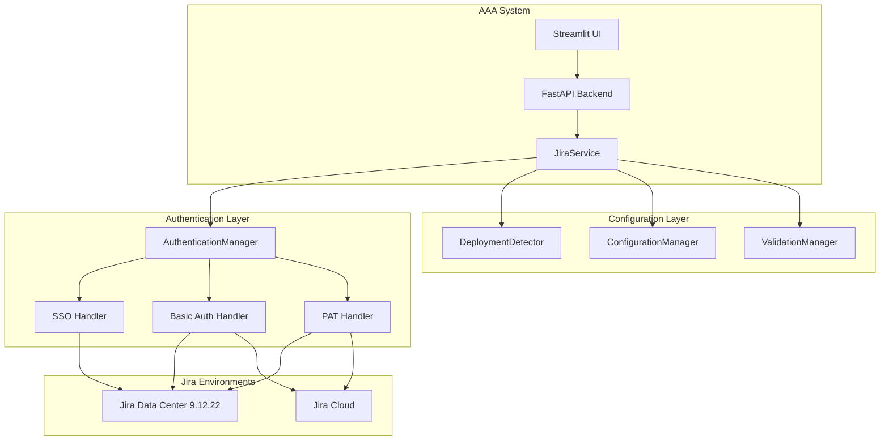

# Design Document

## Overview

This design extends the existing Jira integration to support Jira Data Center 9.12.22 while maintaining backward compatibility with Jira Cloud. The solution introduces a multi-tier authentication system with SSO support, enhanced configuration management, and robust error handling for enterprise environments.

## Architecture

### Current Architecture Analysis

The existing system uses:
- `JiraService` class with basic authentication (email + API token)
- Jira REST API v3 endpoints (`/rest/api/3/`) as well as support for REST API v2 endpoints (`/rest/api/2/`)
- Simple configuration via `JiraConfig` model
- Basic error handling for Cloud-specific scenarios

### Enhanced Architecture



## Components and Interfaces

### 1. Enhanced JiraConfig Model

```python
class JiraAuthType(str, Enum):
    API_TOKEN = "api_token"
    PERSONAL_ACCESS_TOKEN = "pat"
    SSO = "sso"
    BASIC = "basic"

class JiraDeploymentType(str, Enum):
    CLOUD = "cloud"
    DATA_CENTER = "data_center"
    SERVER = "server"

class JiraConfig(BaseModel):
    base_url: str
    deployment_type: Optional[JiraDeploymentType] = None
    auth_type: JiraAuthType = JiraAuthType.API_TOKEN
    
    # Existing fields
    email: Optional[str] = None
    api_token: Optional[str] = None
    
    # New fields for Data Center
    username: Optional[str] = None
    password: Optional[str] = None
    personal_access_token: Optional[str] = None
    
    # Network configuration
    verify_ssl: bool = True
    ca_cert_path: Optional[str] = None
    proxy_url: Optional[str] = None
    timeout: int = 30
    
    # SSO configuration
    use_sso: bool = False
    sso_session_cookie: Optional[str] = None
    
    # Data Center specific
    context_path: Optional[str] = None
    custom_port: Optional[int] = None
```

### 2. Authentication Manager

```python
class AuthenticationManager:
    """Manages different authentication methods for Jira."""
    
    def __init__(self, config: JiraConfig):
        self.config = config
        self.handlers = {
            JiraAuthType.SSO: SSOAuthHandler(),
            JiraAuthType.BASIC: BasicAuthHandler(),
            JiraAuthType.API_TOKEN: APITokenHandler(),
            JiraAuthType.PERSONAL_ACCESS_TOKEN: PATHandler()
        }
    
    async def authenticate(self) -> AuthResult:
        """Attempt authentication with fallback chain."""
        
    async def get_auth_headers(self) -> Dict[str, str]:
        """Get authentication headers for API requests."""
```

### 3. Deployment Detector

```python
class DeploymentDetector:
    """Detects Jira deployment type and version."""
    
    async def detect_deployment(self, base_url: str) -> DeploymentInfo:
        """Detect if URL points to Cloud or Data Center."""
        
    async def get_version_info(self, base_url: str, auth_headers: Dict) -> VersionInfo:
        """Get Jira version and build information."""
        
    def is_data_center_compatible(self, version: str) -> bool:
        """Check if version is compatible with our implementation."""
        
    async def detect_api_version(self, base_url: str, auth_headers: Dict) -> str:
        """Detect which API version (v2 or v3) to use."""
        
    def get_preferred_api_version(self, jira_version: str) -> str:
        """Get preferred API version based on Jira version."""
```

### 4. API Version Manager

```python
class APIVersionManager:
    """Manages API version selection and endpoint construction."""
    
    def __init__(self, preferred_version: str = "3"):
        self.preferred_version = preferred_version
        self.fallback_version = "2"
    
    def build_endpoint(self, base_url: str, resource: str, api_version: str = None) -> str:
        """Build API endpoint URL with appropriate version."""
        
    async def test_api_version(self, base_url: str, auth_headers: Dict, version: str) -> bool:
        """Test if specific API version is available."""
        
    async def get_working_api_version(self, base_url: str, auth_headers: Dict) -> str:
        """Get working API version with fallback logic."""
```

### 5. Enhanced JiraService

The existing `JiraService` will be extended with:

```python
class JiraService:
    def __init__(self, config: JiraConfig):
        self.config = config
        self.auth_manager = AuthenticationManager(config)
        self.deployment_detector = DeploymentDetector()
        self.api_version_manager = APIVersionManager()
        self.session_cache = {}  # For SSO session management
        self.api_version = None  # Detected API version
    
    async def auto_configure(self) -> JiraConfig:
        """Auto-detect deployment type and configure appropriately."""
        
    async def test_connection_with_fallback(self) -> ConnectionResult:
        """Test connection with authentication fallback chain."""
        
    async def authenticate_with_sso(self) -> bool:
        """Attempt SSO authentication using current session."""
        
    async def prompt_basic_auth_fallback(self) -> BasicAuthCredentials:
        """Prompt user for basic auth credentials as fallback."""
        
    async def detect_and_set_api_version(self) -> str:
        """Detect and set the appropriate API version to use."""
```

## Data Models

### Authentication Result Models

```python
class AuthResult(BaseModel):
    success: bool
    auth_type: JiraAuthType
    headers: Dict[str, str]
    error_message: Optional[str] = None
    requires_fallback: bool = False

class DeploymentInfo(BaseModel):
    deployment_type: JiraDeploymentType
    version: str
    build_number: Optional[str] = None
    base_url_normalized: str
    context_path: Optional[str] = None
    supports_sso: bool = False
    supports_pat: bool = False

class ConnectionResult(BaseModel):
    success: bool
    deployment_info: Optional[DeploymentInfo] = None
    auth_result: Optional[AuthResult] = None
    error_details: Optional[Dict[str, Any]] = None
    troubleshooting_steps: List[str] = []
```

### Enhanced Request Models

```python
class JiraTestRequest(BaseModel):
    base_url: str
    auth_type: JiraAuthType = JiraAuthType.API_TOKEN
    
    # Optional authentication fields
    email: Optional[str] = None
    api_token: Optional[str] = None
    username: Optional[str] = None
    password: Optional[str] = None
    personal_access_token: Optional[str] = None
    
    # Network options
    verify_ssl: bool = True
    proxy_url: Optional[str] = None
    use_sso: bool = False

class JiraFetchRequest(JiraTestRequest):
    ticket_key: str
```

## Error Handling

### Data Center Specific Error Handling

1. **SSL Certificate Issues**
   - Detect self-signed certificate errors
   - Provide guidance on certificate configuration
   - Support custom CA bundles

2. **Authentication Failures**
   - Distinguish between different auth failure types
   - Provide specific guidance for each auth method
   - Implement fallback chain with user prompts

3. **Network Connectivity**
   - Handle proxy configuration issues
   - Detect firewall/network restrictions
   - Provide network diagnostic information

4. **Version Compatibility**
   - Detect unsupported Jira versions
   - Provide upgrade recommendations
   - Handle API differences gracefully

### Error Response Enhancement

```python
class JiraErrorDetail(BaseModel):
    error_type: str
    error_code: Optional[str] = None
    message: str
    troubleshooting_steps: List[str]
    documentation_links: List[str] = []
    suggested_config_changes: Optional[Dict[str, Any]] = None

class EnhancedJiraTestResponse(BaseModel):
    ok: bool
    message: str
    deployment_info: Optional[DeploymentInfo] = None
    error_details: Optional[JiraErrorDetail] = None
    auth_methods_available: List[JiraAuthType] = []
```

## Testing Strategy

### Unit Tests
- Authentication handler tests for each auth type
- Deployment detection tests with mocked responses
- Configuration validation tests
- Error handling tests for Data Center scenarios

### Integration Tests
- End-to-end authentication flows
- Fallback mechanism testing
- SSL certificate handling
- Proxy configuration testing

### Mock Data Center Environment
- Docker container with Jira Data Center simulation
- Test different authentication scenarios
- Network condition simulation (timeouts, SSL issues)

## Security Considerations

### Credential Handling
- SSO session cookies stored securely in memory only
- Basic auth credentials never persisted to disk
- Secure credential prompting in UI
- Automatic credential cleanup on session end

### Network Security
- SSL certificate validation with custom CA support
- Proxy authentication support
- Request/response logging with credential redaction
- Rate limiting for authentication attempts

### Enterprise Compliance
- Audit logging for all authentication attempts
- Support for enterprise security policies
- Integration with existing security monitoring
- Compliance with data retention policies

## Implementation Phases

### Phase 1: Core Infrastructure
- Enhanced JiraConfig model
- Deployment detection
- Basic authentication handlers

### Phase 2: Authentication System
- SSO authentication implementation
- Fallback mechanism
- Credential management

### Phase 3: UI Integration
- Enhanced configuration UI
- Authentication prompts
- Error handling and troubleshooting

### Phase 4: Testing and Validation
- Comprehensive test suite
- Documentation updates
- Performance optimization

## Migration Strategy

### Backward Compatibility
- Existing configurations continue to work unchanged
- Automatic migration of old config format
- Deprecation warnings for old patterns
- Gradual rollout of new features

### Configuration Migration
```python
def migrate_legacy_config(old_config: dict) -> JiraConfig:
    """Migrate legacy Jira configuration to new format."""
    return JiraConfig(
        base_url=old_config["base_url"],
        email=old_config.get("email"),
        api_token=old_config.get("api_token"),
        deployment_type=JiraDeploymentType.CLOUD,  # Assume Cloud for legacy
        auth_type=JiraAuthType.API_TOKEN
    )
```

## Performance Considerations

### Caching Strategy
- Deployment detection results cached per base URL
- Authentication tokens cached securely
- Version information cached with TTL
- Connection test results cached briefly

### Optimization
- Parallel authentication attempts where safe
- Connection pooling for multiple requests
- Timeout optimization for enterprise networks
- Retry logic with exponential backoff

## Monitoring and Observability

### Metrics
- Authentication success/failure rates by type
- Connection test performance by deployment type
- Error frequency by category
- Usage patterns by authentication method

### Logging
- Structured logging for all Jira operations
- Authentication attempt logging (without credentials)
- Performance metrics logging
- Error details with troubleshooting context