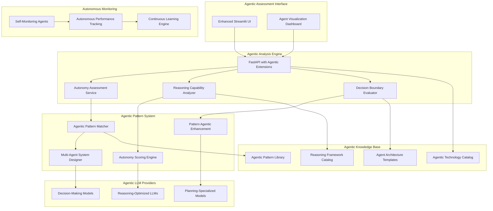

# Design Document

## Overview

The True Agentic AI Assessment platform transforms the existing AAA system into a comprehensive evaluation tool for autonomous AI agent solutions. The system prioritizes fully autonomous agents capable of reasoning, planning, decision-making, and self-healing over traditional automation approaches. The architecture introduces agentic pattern libraries, autonomous decision assessment engines, multi-agent system design capabilities, and aggressive automation feasibility scoring that defaults to full autonomy.

## Architecture

### High-Level Agentic Architecture



### Agentic Request Flow

1. **Agentic Ingestion**: Requirements analyzed for autonomous potential → Agentic session created
2. **Autonomy Assessment**: PARSING → REASONING_ANALYSIS → DECISION_MAPPING → AGENTIC_MATCHING → AUTONOMOUS_DESIGN → COMPLETE
3. **Agentic Q&A Loop**: Questions focus on decision boundaries, reasoning requirements, and autonomy constraints
4. **Autonomous Pattern Matching**: Prioritize fully autonomous patterns → Score by autonomy level → Design multi-agent systems when needed
5. **Agentic Export**: Generate autonomous system blueprints → Agent interaction diagrams → Implementation roadmaps

## Components and Interfaces

### Agentic Configuration Management (`app/config.py`)

```python
class AgenticSettings(BaseSettings):
    # Agentic-specific configurations
    autonomy_threshold: float = 0.8  # Minimum autonomy score for recommendations
    reasoning_complexity_levels: List[str] = ["simple", "moderate", "complex", "expert"]
    decision_boundary_types: List[str] = ["rule_based", "contextual", "creative", "strategic"]
    agent_architecture_patterns: List[str] = ["single_agent", "multi_agent", "hierarchical", "swarm"]
    
    # Agentic LLM configurations
    reasoning_model: str = "gpt-4o"  # Best for complex reasoning
    planning_model: str = "claude-3-opus"  # Excellent for planning
    decision_model: str = "gpt-4o"  # Strong decision-making
    
    # Autonomy scoring weights
    autonomy_weights: Dict[str, float] = {
        "reasoning_capability": 0.3,
        "decision_independence": 0.25,
        "exception_handling": 0.2,
        "learning_adaptation": 0.15,
        "self_monitoring": 0.1
    }
    
    # Agentic technology preferences
    preferred_agentic_frameworks: List[str] = [
        "LangChain", "AutoGPT", "CrewAI", "Microsoft Semantic Kernel",
        "OpenAI Assistants API", "Anthropic Claude Computer Use"
    ]
```

### Autonomy Assessment Service (`app/services/autonomy_assessor.py`)

```python
class AutonomyAssessor:
    def __init__(self, 
                 reasoning_analyzer: ReasoningAnalyzer,
                 decision_evaluator: DecisionEvaluator,
                 workflow_analyzer: WorkflowAnalyzer):
        self.reasoning_analyzer = reasoning_analyzer
        self.decision_evaluator = decision_evaluator
        self.workflow_analyzer = workflow_analyzer
    
    async def assess_autonomy_potential(self, 
                                      requirements: Dict[str, Any]) -> AutonomyAssessment:
        """Assess how autonomous an AI agent can be for given requirements."""
        
        # Analyze reasoning requirements
        reasoning_needs = await self.reasoning_analyzer.analyze_reasoning_complexity(
            requirements["description"]
        )
        
        # Evaluate decision-making scope
        decision_scope = await self.decision_evaluator.map_decision_boundaries(
            requirements
        )
        
        # Assess workflow autonomy potential
        workflow_autonomy = await self.workflow_analyzer.evaluate_end_to_end_automation(
            requirements.get("workflow_steps", [])
        )
        
        # Calculate overall autonomy score
        autonomy_score = self._calculate_autonomy_score(
            reasoning_needs, decision_scope, workflow_autonomy
        )
        
        return AutonomyAssessment(
            overall_score=autonomy_score,
            reasoning_complexity=reasoning_needs.complexity_level,
            decision_independence=decision_scope.independence_level,
            workflow_coverage=workflow_autonomy.coverage_percentage,
            recommended_architecture=self._recommend_agent_architecture(autonomy_score),
            autonomous_capabilities=self._identify_autonomous_capabilities(
                reasoning_needs, decision_scope, workflow_autonomy
            )
        )
    
    def _calculate_autonomy_score(self, 
                                reasoning: ReasoningNeeds,
                                decisions: DecisionScope, 
                                workflow: WorkflowAutonomy) -> float:
        """Calculate weighted autonomy score."""
        weights = self.config.autonomy_weights
        
        score = (
            reasoning.autonomy_potential * weights["reasoning_capability"] +
            decisions.independence_score * weights["decision_independence"] +
            workflow.exception_handling_score * weights["exception_handling"] +
            workflow.learning_potential * weights["learning_adaptation"] +
            workflow.self_monitoring_capability * weights["self_monitoring"]
        )
        
        return min(1.0, score)  # Cap at 1.0
```

### Agentic Pattern Matcher (`app/pattern/agentic_matcher.py`)

```python
class AgenticPatternMatcher:
    def __init__(self,
                 autonomy_assessor: AutonomyAssessor,
                 pattern_enhancer: PatternAgenticEnhancer,
                 multi_agent_designer: MultiAgentSystemDesigner):
        self.autonomy_assessor = autonomy_assessor
        self.pattern_enhancer = pattern_enhancer
        self.multi_agent_designer = multi_agent_designer
    
    async def match_agentic_patterns(self, 
                                   requirements: Dict[str, Any],
                                   autonomy_assessment: AutonomyAssessment) -> List[AgenticPatternMatch]:
        """Match patterns prioritizing autonomous agent solutions."""
        
        # Load and filter agentic patterns
        agentic_patterns = await self._load_agentic_patterns()
        
        # Score patterns by autonomy potential
        scored_patterns = []
        for pattern in agentic_patterns:
            autonomy_score = self._score_pattern_autonomy(pattern, autonomy_assessment)
            agentic_enhancement = await self.pattern_enhancer.enhance_for_autonomy(
                pattern, requirements
            )
            
            scored_patterns.append(AgenticPatternMatch(
                pattern_id=pattern.pattern_id,
                base_pattern=pattern,
                enhanced_pattern=agentic_enhancement,
                autonomy_score=autonomy_score,
                reasoning_capabilities=agentic_enhancement.reasoning_capabilities,
                decision_scope=agentic_enhancement.decision_scope,
                exception_handling=agentic_enhancement.exception_handling_strategy
            ))
        
        # Sort by autonomy score (highest first)
        scored_patterns.sort(key=lambda x: x.autonomy_score, reverse=True)
        
        # Design multi-agent systems for complex scenarios
        if autonomy_assessment.recommended_architecture in ["multi_agent", "hierarchical", "swarm"]:
            multi_agent_design = await self.multi_agent_designer.design_system(
                requirements, scored_patterns[:3]
            )
            scored_patterns.insert(0, multi_agent_design)
        
        return scored_patterns
    
    def _score_pattern_autonomy(self, 
                              pattern: Pattern, 
                              assessment: AutonomyAssessment) -> float:
        """Score pattern based on autonomy capabilities."""
        
        # Base autonomy score from pattern
        base_score = pattern.get("autonomy_level", 0.5)
        
        # Bonus for agentic pattern types
        agentic_types = [
            "agentic_reasoning", "autonomous_decision", "self_healing",
            "continuous_learning", "exception_reasoning", "multi_agent"
        ]
        agentic_bonus = sum(0.1 for ptype in pattern.pattern_type if ptype in agentic_types)
        
        # Penalty for human-in-the-loop requirements
        human_penalty = -0.3 if "human_in_loop" in pattern.pattern_type else 0
        
        # Alignment with assessment
        alignment_bonus = 0.2 if assessment.overall_score > 0.8 else 0
        
        return min(1.0, base_score + agentic_bonus + human_penalty + alignment_bonus)
```

### Reasoning Capability Analyzer (`app/services/reasoning_analyzer.py`)

```python
class ReasoningAnalyzer:
    def __init__(self, llm_provider: LLMProvider):
        self.llm_provider = llm_provider
        self.reasoning_types = {
            "logical": "Step-by-step logical deduction and inference",
            "causal": "Understanding cause-and-effect relationships",
            "temporal": "Reasoning about time sequences and dependencies",
            "spatial": "Understanding spatial relationships and constraints",
            "analogical": "Drawing parallels from similar situations",
            "case_based": "Learning from historical examples and cases"
        }
    
    async def analyze_reasoning_complexity(self, description: str) -> ReasoningNeeds:
        """Analyze what types of reasoning an agent would need."""
        
        prompt = f"""
        Analyze the following requirement and determine what types of reasoning an AI agent would need to handle this autonomously:

        Requirement: {description}

        For each reasoning type, assess the complexity level (none/low/medium/high) and provide justification:
        
        1. Logical Reasoning: {self.reasoning_types["logical"]}
        2. Causal Reasoning: {self.reasoning_types["causal"]}
        3. Temporal Reasoning: {self.reasoning_types["temporal"]}
        4. Spatial Reasoning: {self.reasoning_types["spatial"]}
        5. Analogical Reasoning: {self.reasoning_types["analogical"]}
        6. Case-Based Reasoning: {self.reasoning_types["case_based"]}

        Also assess:
        - Overall reasoning complexity: simple/moderate/complex/expert
        - Autonomy potential: 0.0-1.0 (how much can be automated through reasoning)
        - Key reasoning challenges
        - Recommended reasoning frameworks

        Respond in JSON format.
        """
        
        response = await self.llm_provider.generate(prompt)
        reasoning_analysis = json.loads(response)
        
        return ReasoningNeeds(
            complexity_level=reasoning_analysis["overall_complexity"],
            autonomy_potential=float(reasoning_analysis["autonomy_potential"]),
            required_types=reasoning_analysis["reasoning_types"],
            challenges=reasoning_analysis["challenges"],
            recommended_frameworks=reasoning_analysis["frameworks"]
        )
```

### Multi-Agent System Designer (`app/services/multi_agent_designer.py`)

```python
class MultiAgentSystemDesigner:
    def __init__(self, llm_provider: LLMProvider):
        self.llm_provider = llm_provider
        self.agent_roles = {
            "coordinator": "Orchestrates overall workflow and agent communication",
            "specialist": "Handles domain-specific tasks requiring expertise",
            "validator": "Verifies outputs and ensures quality standards",
            "executor": "Performs concrete actions and implementations",
            "monitor": "Tracks performance and handles exceptions",
            "learner": "Analyzes patterns and improves system performance"
        }
    
    async def design_system(self, 
                          requirements: Dict[str, Any],
                          top_patterns: List[AgenticPatternMatch]) -> MultiAgentSystemDesign:
        """Design a multi-agent system for complex autonomous workflows."""
        
        # Analyze workflow complexity
        workflow_analysis = await self._analyze_workflow_complexity(requirements)
        
        # Design agent architecture
        if workflow_analysis.complexity_score > 0.8:
            architecture = "hierarchical"
        elif workflow_analysis.parallel_potential > 0.7:
            architecture = "peer_to_peer"
        else:
            architecture = "coordinator_based"
        
        # Define agent roles and responsibilities
        agent_roles = await self._define_agent_roles(requirements, workflow_analysis)
        
        # Design communication protocols
        communication_design = await self._design_communication_protocols(
            agent_roles, architecture
        )
        
        # Create coordination mechanisms
        coordination_mechanisms = await self._design_coordination_mechanisms(
            agent_roles, workflow_analysis
        )
        
        return MultiAgentSystemDesign(
            architecture_type=architecture,
            agent_roles=agent_roles,
            communication_protocols=communication_design,
            coordination_mechanisms=coordination_mechanisms,
            autonomy_score=self._calculate_system_autonomy_score(agent_roles),
            recommended_frameworks=self._recommend_multi_agent_frameworks(architecture)
        )
    
    async def _define_agent_roles(self, 
                                requirements: Dict[str, Any],
                                workflow_analysis: WorkflowAnalysis) -> List[AgentRole]:
        """Define specific agent roles for the multi-agent system."""
        
        prompt = f"""
        Design a multi-agent system for this requirement:
        
        Requirement: {requirements["description"]}
        Workflow Complexity: {workflow_analysis.complexity_score}
        Parallel Potential: {workflow_analysis.parallel_potential}
        
        Define 3-6 specialized agents with:
        1. Role name and primary responsibility
        2. Specific capabilities and decision-making authority
        3. Input/output interfaces
        4. Autonomy level (0.0-1.0)
        5. Exception handling strategies
        
        Focus on maximizing autonomy while ensuring coordination.
        Respond in JSON format with agent definitions.
        """
        
        response = await self.llm_provider.generate(prompt)
        agent_definitions = json.loads(response)
        
        return [
            AgentRole(
                name=agent["name"],
                responsibility=agent["responsibility"],
                capabilities=agent["capabilities"],
                decision_authority=agent["decision_authority"],
                autonomy_level=agent["autonomy_level"],
                interfaces=agent["interfaces"],
                exception_handling=agent["exception_handling"]
            )
            for agent in agent_definitions["agents"]
        ]
```

## Data Models

### Agentic Assessment Models

```python
@dataclass
class AutonomyAssessment:
    overall_score: float  # 0.0-1.0
    reasoning_complexity: str  # simple/moderate/complex/expert
    decision_independence: str  # low/medium/high/full
    workflow_coverage: float  # Percentage of workflow that can be automated
    recommended_architecture: str  # single_agent/multi_agent/hierarchical/swarm
    autonomous_capabilities: List[str]
    reasoning_requirements: List[str]
    decision_boundaries: Dict[str, Any]
    exception_handling_strategy: str

@dataclass
class AgenticPatternMatch:
    pattern_id: str
    base_pattern: Pattern
    enhanced_pattern: AgenticPattern
    autonomy_score: float
    reasoning_capabilities: List[str]
    decision_scope: Dict[str, Any]
    exception_handling: str
    multi_agent_potential: bool
    recommended_frameworks: List[str]

@dataclass
class AgenticPattern(Pattern):
    # Extends base Pattern with agentic capabilities
    autonomy_level: float  # 0.0-1.0
    reasoning_types: List[str]
    decision_boundaries: Dict[str, Any]
    exception_handling_strategy: str
    learning_mechanisms: List[str]
    self_monitoring_capabilities: List[str]
    agent_architecture: str
    coordination_requirements: Optional[Dict[str, Any]]

@dataclass
class MultiAgentSystemDesign:
    architecture_type: str  # hierarchical/peer_to_peer/coordinator_based
    agent_roles: List[AgentRole]
    communication_protocols: List[CommunicationProtocol]
    coordination_mechanisms: List[CoordinationMechanism]
    autonomy_score: float
    recommended_frameworks: List[str]
    deployment_strategy: str

@dataclass
class AgentRole:
    name: str
    responsibility: str
    capabilities: List[str]
    decision_authority: Dict[str, Any]
    autonomy_level: float
    interfaces: Dict[str, Any]
    exception_handling: str
    learning_capabilities: List[str]
```

### Agentic Technology Catalog

```python
class AgenticTechnologyCatalog:
    def __init__(self):
        self.agentic_frameworks = {
            "LangChain": {
                "category": "agent_framework",
                "autonomy_support": 0.9,
                "reasoning_capabilities": ["chain_of_thought", "react", "plan_and_execute"],
                "decision_making": "high",
                "multi_agent_support": True,
                "learning_mechanisms": ["few_shot", "retrieval_augmented"]
            },
            "AutoGPT": {
                "category": "autonomous_agent",
                "autonomy_support": 0.95,
                "reasoning_capabilities": ["goal_decomposition", "self_reflection"],
                "decision_making": "very_high",
                "multi_agent_support": False,
                "learning_mechanisms": ["memory_persistence", "self_improvement"]
            },
            "CrewAI": {
                "category": "multi_agent_framework",
                "autonomy_support": 0.85,
                "reasoning_capabilities": ["collaborative_reasoning", "role_specialization"],
                "decision_making": "high",
                "multi_agent_support": True,
                "learning_mechanisms": ["collective_learning", "role_adaptation"]
            }
        }
        
        self.reasoning_engines = {
            "Neo4j": {
                "category": "knowledge_graph",
                "reasoning_types": ["logical", "causal", "spatial"],
                "autonomy_enhancement": 0.7
            },
            "Prolog": {
                "category": "logic_programming",
                "reasoning_types": ["logical", "rule_based"],
                "autonomy_enhancement": 0.8
            }
        }
```

## Error Handling

### Agentic Exception Handling

```python
class AgenticExceptionHandler:
    def __init__(self, reasoning_engine: ReasoningEngine):
        self.reasoning_engine = reasoning_engine
        self.exception_strategies = {
            "reasoning_failure": self._handle_reasoning_failure,
            "decision_uncertainty": self._handle_decision_uncertainty,
            "workflow_interruption": self._handle_workflow_interruption,
            "multi_agent_conflict": self._handle_agent_conflict
        }
    
    async def handle_exception(self, 
                             exception_type: str,
                             context: Dict[str, Any],
                             agent_state: AgentState) -> ExceptionResolution:
        """Handle exceptions through agent reasoning rather than escalation."""
        
        # Attempt autonomous resolution
        resolution_strategy = await self.reasoning_engine.analyze_exception(
            exception_type, context, agent_state
        )
        
        # Try multiple resolution approaches
        for approach in resolution_strategy.approaches:
            try:
                result = await self._execute_resolution_approach(approach, context)
                if result.success:
                    return ExceptionResolution(
                        resolved=True,
                        method="autonomous_reasoning",
                        approach=approach,
                        learning_update=result.learning_update
                    )
            except Exception as e:
                continue  # Try next approach
        
        # If all autonomous approaches fail, provide comprehensive context for escalation
        return ExceptionResolution(
            resolved=False,
            method="escalation_with_context",
            attempted_approaches=resolution_strategy.approaches,
            recommended_human_action=resolution_strategy.escalation_recommendation,
            context_for_human=self._prepare_escalation_context(context, agent_state)
        )
```

## Testing Strategy

### Agentic Testing Framework

```python
class AgenticTestFramework:
    def __init__(self):
        self.autonomy_test_scenarios = [
            "single_agent_decision_making",
            "multi_agent_coordination",
            "exception_handling_through_reasoning",
            "continuous_learning_adaptation",
            "self_monitoring_and_healing"
        ]
    
    async def test_autonomy_assessment(self, requirements: Dict[str, Any]) -> TestResults:
        """Test that autonomy assessment prioritizes agentic solutions."""
        
        # Test autonomy scoring
        autonomy_score = await self.autonomy_assessor.assess_autonomy_potential(requirements)
        assert autonomy_score.overall_score >= 0.7, "Should find high autonomy potential"
        
        # Test agentic pattern matching
        patterns = await self.agentic_matcher.match_agentic_patterns(requirements, autonomy_score)
        assert all(p.autonomy_score >= 0.6 for p in patterns), "All patterns should be highly autonomous"
        
        # Test multi-agent system design for complex scenarios
        if autonomy_score.recommended_architecture == "multi_agent":
            multi_agent_design = await self.multi_agent_designer.design_system(requirements, patterns)
            assert len(multi_agent_design.agent_roles) >= 3, "Should design multiple specialized agents"
        
        return TestResults(passed=True, details="Autonomy assessment working correctly")
    
    async def test_reasoning_capabilities(self, scenario: str) -> TestResults:
        """Test agent reasoning in various scenarios."""
        
        test_cases = {
            "logical_reasoning": "If A implies B and B implies C, what can we conclude about A and C?",
            "causal_reasoning": "Sales dropped 20% after the price increase. What might be the relationship?",
            "temporal_reasoning": "Task A must complete before Task B, which enables Task C. What's the sequence?",
            "exception_handling": "The API is down but users need data. What are the autonomous options?"
        }
        
        for reasoning_type, test_prompt in test_cases.items():
            result = await self.reasoning_analyzer.analyze_reasoning_complexity(test_prompt)
            assert result.autonomy_potential > 0.5, f"Should find autonomous solution for {reasoning_type}"
        
        return TestResults(passed=True, details="Reasoning capabilities tested successfully")
```

## Performance Considerations

### Agentic Performance Optimization

- **Reasoning Cache**: Cache reasoning patterns and decision trees for similar scenarios
- **Agent State Management**: Efficient state persistence for multi-agent systems
- **Parallel Agent Execution**: Concurrent processing for independent agent tasks
- **Adaptive Learning**: Incremental model updates based on agent performance
- **Resource Allocation**: Dynamic resource allocation based on agent workload

### Autonomous Monitoring

- **Self-Assessment Metrics**: Agents monitor their own performance and accuracy
- **Adaptation Triggers**: Automatic strategy adjustment based on performance thresholds
- **Continuous Learning**: Real-time incorporation of new patterns and feedback
- **Predictive Scaling**: Anticipate resource needs based on workflow complexity