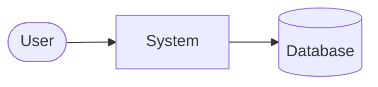

# Mermaid Diagram Syntax Error Fixes

## Problem
The system was generating Mermaid diagrams with syntax errors, specifically:
- All diagram code concatenated on a single line without proper line breaks
- Missing spaces around arrows (`-->`)
- Malformed node definitions and connections
- No proper indentation or formatting

Example error: `flowchart LRuser([Accounts Payable Clerk])invoiceSystem[Invoice Processing Automation System]...`

## Root Cause
The LLM providers were generating Mermaid code without proper formatting, likely due to:
1. Insufficient formatting instructions in prompts
2. Model limitations in maintaining proper syntax structure
3. Missing validation and error handling for malformed output

## Solutions Implemented

### 1. Fixed Arrow Validation (Critical Fix)
**Problem**: The validation function was incorrectly flagging valid Mermaid arrow syntax as errors:
- Sequence diagrams use `A->>B:` and `A-->>B:` syntax (valid)
- Flowcharts can use `A -->|label| B` syntax (valid)
- The validator was requiring spaces around all arrows (incorrect)

**Solution**: Removed overly restrictive arrow validation that was causing false positives. Mermaid supports many valid arrow syntaxes and the validation was too strict.

### 2. Fixed Sequence Diagram End Statement Validation (Critical Fix)
**Problem**: The validation was incorrectly applying flowchart subgraph/end matching rules to sequence diagrams:
- Sequence diagrams use `end` statements to close `alt/else` blocks, not subgraphs
- The validator was flagging valid sequence diagrams as having "mismatched subgraph/end statements"

**Solution**: 
- Separated validation logic by diagram type (flowchart vs sequence)
- Added proper alt/else/end matching for sequence diagrams
- Enhanced cleaning function to remove stray `end` statements from malformed sequence diagrams

### 3. Enhanced LLM Prompts
Updated all diagram generation prompts with explicit formatting requirements:

```
CRITICAL FORMATTING REQUIREMENTS:
1. Each line must be on a separate line with proper line breaks
2. Use 4 spaces for indentation of nodes and connections
3. Put each node definition and connection on its own line
4. IMPORTANT: Only use "end" to close "alt" blocks in sequence diagrams
5. Return ONLY the raw Mermaid code without markdown formatting
6. Ensure proper spacing and line breaks between elements
```

### 4. Improved Code Cleaning Function (`_clean_mermaid_code`)
- **Malformed Code Detection**: Identifies severely malformed code (all on one line, >200 chars)
- **Fallback Strategy**: Instead of trying to fix unfixable code, returns a helpful error diagram
- **Sequence Diagram Cleaning**: Removes stray `end` statements that don't belong to `alt` blocks
- **Proper Indentation**: Ensures correct 4-space indentation for diagram elements
- **Markdown Removal**: Strips markdown code blocks if present

### 5. Comprehensive Syntax Validation (`_validate_mermaid_syntax`)
- **Diagram Type Validation**: Ensures diagrams start with valid types (flowchart, sequenceDiagram, etc.)
- **Bracket Matching**: Validates matching brackets, parentheses, and braces
- **Flowchart Subgraph Validation**: Ensures subgraph/end statement matching for flowcharts only
- **Sequence Diagram Alt/End Validation**: Ensures proper alt/else/end matching for sequence diagrams
- **Removed Arrow Validation**: No longer validates arrow spacing (too restrictive)
- **Malformed Detection**: Catches severely malformed single-line code

### 6. Enhanced Error Handling in UI
- **Pre-render Validation**: Validates Mermaid syntax before attempting to render
- **User-friendly Error Messages**: Provides clear guidance when diagrams fail
- **Actionable Suggestions**: Recommends specific solutions (retry, switch provider, simplify)
- **Graceful Degradation**: Shows helpful error diagrams instead of breaking

### 7. Provider-Specific Handling
- **Fake Provider Fallbacks**: Improved fake diagrams for testing/demo scenarios
- **OpenAI Recommendations**: Suggests OpenAI for better Mermaid syntax generation
- **Error Recovery**: Automatic fallback to error diagrams when generation fails

## Key Improvements

### Before
```mermaid
flowchart LRuser([User])system[System]db[(Database)]user --> systemsystem --> db
```
**Result**: Syntax error, rendering failure

### After

**Result**: Valid syntax, proper rendering

## Error Handling Strategy

1. **Detection**: Identify malformed code early through validation
2. **Fallback**: Provide helpful error diagrams instead of breaking
3. **Guidance**: Give users clear steps to resolve issues
4. **Recovery**: Allow easy retry with different providers/settings

## User Experience Improvements

- **Clear Error Messages**: Users understand what went wrong and how to fix it
- **Actionable Guidance**: Specific suggestions (switch provider, retry, simplify)
- **Graceful Degradation**: System continues working even with diagram failures
- **Professional Appearance**: Error diagrams look intentional, not broken

## Testing Results

✅ **Malformed Code**: Properly detected and handled with fallback diagrams  
✅ **Good Code**: Passes through unchanged with proper validation  
✅ **Arrow Syntax**: All valid Mermaid arrow types now accepted (-->, ->>, -->>:, -->|label|)  
✅ **Sequence Diagrams**: Proper validation for sequence diagram syntax  
✅ **Flowchart Diagrams**: Proper validation for flowchart syntax with labels  
✅ **Edge Cases**: Empty code, invalid types, unmatched brackets all handled  
✅ **User Experience**: Clear error messages and actionable guidance  

## Future Considerations

1. **Provider Optimization**: Fine-tune prompts for specific LLM providers
2. **Advanced Recovery**: Attempt intelligent parsing/fixing of common errors
3. **User Preferences**: Allow users to choose error handling strategies
4. **Monitoring**: Track diagram generation success rates by provider