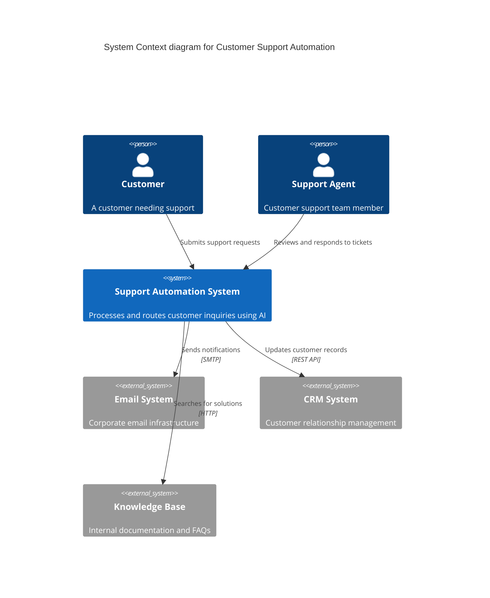
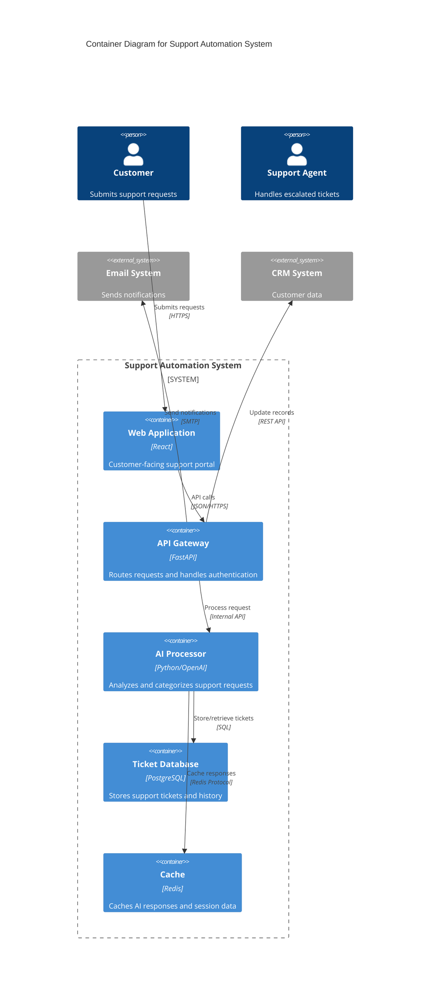

# Automated AI Assessment (AAA)

Interactive GUI + API system that judges if user stories/requirements are automatable with **autonomous agentic AI**. The system uses advanced AI reasoning to assess autonomy potential, matches requirements to agentic solution patterns, and provides comprehensive feasibility assessments with detailed implementation guidance.

## Features

### 🔄 **Session Management** *(Enhanced in v2.6.0)*
- 🔄 **Resume Previous Session**: Complete session continuity functionality with UUID validation
- 📋 **Session Information Display**: Current session ID with copy-to-clipboard functionality  
- 🔗 **Cross-Session Compatibility**: Works with all input methods (Text, File Upload, Jira Integration)
- 📚 **Comprehensive Help System**: "Where do I find my Session ID?" guidance with detailed instructions
- 🛡️ **Robust Validation**: UUID format validation with helpful error messages and troubleshooting tips

### ⚙️ **Dynamic Schema System** *(New in v2.5.0)*
- 🔧 **Configurable Validation Enums**: Replace hard-coded JSON schema enums with user-configurable values
- 🎯 **Extended Reasoning Types**: 12+ configurable reasoning types (logical, causal, collaborative, creative, ethical, etc.)
- 📊 **Flexible Monitoring Capabilities**: 9+ configurable self-monitoring capabilities including response_time_monitoring, security_monitoring
- 🧠 **Extensible Learning Mechanisms**: 8+ configurable learning approaches (reinforcement_learning, transfer_learning, meta_learning, etc.)
- 🏗️ **Configurable Agent Architectures**: 7+ agent architecture patterns with user extensibility
- 🛠️ **Management Interfaces**: Both CLI (`manage_schema.py`) and web UI for enum configuration
- 📤 **Configuration Sharing**: Export/import capabilities for team collaboration and environment consistency
- 🔄 **Validation Modes**: Choose between strict validation or flexible extension with auto-addition of new values

### 🤖 **Agentic AI Transformation** *(Enhanced in v2.7.0)*
- 🧠 **Enhanced Autonomous Agent Assessment**: Advanced AI reasoning with multi-dimensional scoring and improved accuracy (90%+ accuracy scores)
- 🎯 **Agentic Pattern Library**: Specialized APAT-* patterns for autonomous agent solutions (95-98% autonomy levels) with enhanced validation
- 🔄 **Multi-Agent System Design**: Hierarchical, collaborative, and swarm intelligence architectures with improved coordination
- 🛡️ **Exception Handling Through Reasoning**: AI agents resolve problems autonomously with enhanced reasoning capabilities
- 📊 **Comprehensive Autonomy Analysis**: Enhanced reasoning complexity, decision boundaries, and workflow automation assessment
- 🎪 **Agentic Technology Catalog**: 12+ specialized frameworks (LangChain, AutoGen, CrewAI, Microsoft Semantic Kernel) with improved categorization

### 🔍 **Enhanced Analysis & Assessment**
- 🤖 **Multi-Provider LLM Support**: OpenAI, Anthropic/Bedrock, Claude Direct, Internal HTTP, FakeLLM for testing
- 🔍 **Intelligent Pattern Matching**: Tag filtering + vector similarity with FAISS, prioritizing autonomous solutions
- ❓ **AI-Generated Q&A System**: LLM creates contextual clarifying questions based on your specific requirement
- 📊 **Advanced Feasibility Assessment**: Detailed insights, challenges, recommended approach, and next steps
- �️ ***LLM-Driven Tech Stack Generation**: Intelligent technology recommendations from 55+ catalog technologies
- 🏗️ **AI-Generated Architecture Explanations**: LLM explains how technology components work together for your specific use case

### 📊 **Visualization & Documentation** *(Enhanced in v2.7.0)*
- 📈 **AI-Generated Architecture Diagrams**: Context, Container, Sequence, C4 Architecture, and Tech Stack Wiring diagrams using Mermaid with enhanced viewing options, v10.2.4 compatibility, and robust LLM response extraction
- 🏗️ **Infrastructure Diagrams**: Cloud architecture diagrams with vendor-specific icons (AWS, GCP, Azure) using mingrammer/diagrams
- 📐 **Draw.io Export**: Export all diagram types to Draw.io format for professional customization, team collaboration, and presentation-ready documentation
- 📚 **Enhanced Technology Catalog Management**: Complete CRUD interface with advanced filtering, bulk operations, and analytics for managing 55+ technologies across 17 categories
- 📊 **Enhanced Pattern Analytics Dashboard**: Real-time analytics with improved filtering, pattern comparison tools, and comprehensive usage metrics
- 🔧 **Enhanced Pattern Management System**: Advanced pattern management with bulk operations, validation, comparison tools, and statistics dashboard

### 🛡️ **Security & Enterprise Features** *(Enhanced in v2.7.0)*
- 🛡️ **Enhanced Advanced Prompt Defense System**: Multi-layered security with improved detection algorithms against prompt injection, data egress, and business logic attacks
- 🎯 **Enterprise Constraints**: Comprehensive technology restrictions, compliance requirements, and integration constraints with enhanced validation
- 🔍 **Enhanced LLM Message Audit Trail**: Complete visibility into LLM prompts and responses with improved logging and security event tracking
- 🔒 **Enhanced Security Validation**: Strengthened input validation, pattern sanitization, and comprehensive error handling with graceful degradation

### 🚀 **Development & Deployment**
- 📤 **Export Results**: JSON, Markdown, and interactive HTML formats with comprehensive analysis
- 🧪 **100% Test Coverage**: TDD approach with deterministic fakes
- 🐳 **Docker Ready**: Complete containerization with docker-compose
- 🔄 **Real-time Progress Tracking**: Live status updates during analysis phases

## Agentic AI Transformation

The system has been transformed from traditional automation assessment to a **true agentic AI platform** that prioritizes autonomous agent solutions over human-assisted processes.

### 🧠 **Autonomous Agent Assessment**

The system performs comprehensive autonomy analysis across multiple dimensions:

**Reasoning Complexity Analysis:**
- Evaluates 8 types of reasoning: logical, causal, temporal, spatial, analogical, case-based, probabilistic, strategic
- Assesses complexity levels: simple, moderate, complex, expert
- Determines autonomy potential with optimistic bias toward full automation

**Decision Boundary Evaluation:**
- Maps autonomous decision-making scope with authority levels: low, medium, high, full
- Identifies specific decisions agents can make independently
- Defines escalation triggers and risk factors

**Workflow Automation Assessment:**
- Analyzes end-to-end automation coverage (typically 80-95%)
- Evaluates exception handling capabilities through reasoning
- Assesses learning potential and self-monitoring capabilities

### 🎯 **Agentic Pattern Library (APAT-*)**

Specialized patterns for autonomous agent solutions:

- **APAT-001**: Autonomous Legal Contract Analysis Agent (98% autonomy)
- **APAT-002**: Autonomous Invoice Processing and Payment Agent (95% autonomy)  
- **APAT-003**: Autonomous Customer Support Resolution Agent (97% autonomy)
- **APAT-004**: Autonomous Payment Dispute Resolution Agent (95% autonomy)

Each pattern includes:
- **Reasoning Types**: Required cognitive capabilities
- **Decision Boundaries**: Autonomous decisions vs escalation triggers
- **Exception Handling**: Reasoning-based problem resolution strategies
- **Learning Mechanisms**: Continuous improvement capabilities
- **Self-Monitoring**: Performance tracking and quality assessment

### 🔄 **Multi-Agent System Design**

When complexity requires it, the system designs sophisticated multi-agent architectures:

**Architecture Types:**
- **Single Agent**: For straightforward autonomous tasks
- **Hierarchical Agents**: Coordinator with specialized sub-agents
- **Collaborative Agents**: Peer-to-peer cooperation
- **Swarm Intelligence**: Distributed problem-solving

**Design Process:**
1. **Workflow Complexity Analysis**: Parallel potential, coordination needs, specialization opportunities
2. **Agent Role Definition**: Specialized agents with specific responsibilities and capabilities
3. **Communication Protocols**: Inter-agent messaging and coordination mechanisms
4. **Conflict Resolution**: Handling disagreements and resource conflicts

### 🛡️ **Exception Handling Through Reasoning**

Instead of escalating to humans, agents use multiple reasoning approaches:

**Autonomous Resolution Strategies:**
- **Case-Based Reasoning**: Learn from historical patterns
- **Logical Reasoning**: Apply rule-based analysis
- **Causal Analysis**: Determine root causes
- **Alternative Generation**: Create multiple solution options
- **Negotiation Protocols**: Resolve conflicts with external systems

**Reasoning Fallbacks:**
- Conservative decision-making when evidence is ambiguous
- Additional evidence gathering through automated outreach
- Escalation only when comprehensive analysis fails

### 🎪 **Agentic Technology Catalog**

Specialized technologies for autonomous agent development:

**Agentic Frameworks:**
- LangChain, AutoGen, CrewAI, Microsoft Semantic Kernel
- Haystack, Rasa, BotFramework, Dialogflow

**Reasoning Engines:**
- Neo4j (graph reasoning), Drools (rule engine)
- Apache Jena, Prolog

**Agent Orchestration:**
- Apache Airflow, Prefect, Temporal, Celery

### 📊 **Enhanced Feasibility Assessment**

The system now provides comprehensive feasibility analysis including:

- **🔍 Key Insights**: Important observations from AI analysis
- **⚠️ Automation Challenges**: Potential obstacles to consider  
- **🎯 Recommended Approach**: Specific implementation strategy
- **📋 Next Steps**: Actionable items to move forward
- **📊 Confidence Level**: AI's confidence in the assessment

**Example Assessment:**
```
🟢 Feasibility: Fully Automatable
This requirement can be completely automated with high confidence.

🔍 Key Insights:
• Salesforce API provides robust data interface for dispute case management
• Rule-based matrix simplifies decision logic for automation
• Self-service web portal reduces need for call center interactions

⚠️ Automation Challenges:
• Ensuring intuitive user experience for all customers
• Integrating Salesforce with Amazon Connect effectively

🎯 Recommended Approach:
Develop self-service web portal integrated with Salesforce via API to manage customer dispute cases. Use rule-based matrix to automate decision-making and communicate results through Amazon Connect.

📋 Next Steps:
• Design user-friendly web portal interface
• Develop API integrations with Salesforce for dispute data
• Automate decision-making logic based on matrix rules

📊 Confidence Level: 85%
```

## Quick Start

### Prerequisites

- Python 3.10+
- pip or uv package manager

### Installation

```bash
# Clone and enter directory
cd agentic_or_not

# Install dependencies
make install
# or
python3 -m pip install -r requirements.txt
```

#### System Dependencies

**For Infrastructure Diagrams (Optional):**

Infrastructure diagrams require Graphviz to be installed on your system:

```bash
# Windows
choco install graphviz
# or
winget install graphviz

# macOS
brew install graphviz

# Linux (Ubuntu/Debian)
sudo apt-get install graphviz

# Verify installation
dot -V
```

**Note:** If Graphviz is not installed, you can still use all other diagram types (Context, Container, Sequence, C4, Tech Stack Wiring, Agent Interaction). See `GRAPHVIZ_INSTALLATION_GUIDE.md` for detailed instructions.

### Running the Application

#### Option 1: Using Make (Recommended)

```bash
# Start both API and UI (opens browser automatically)
make dev
# or
make up

# Or start services individually:
make api        # FastAPI only
make streamlit  # Streamlit UI only (opens browser)
```

This starts:
- FastAPI server at http://localhost:8000
- Streamlit UI at http://localhost:8501 (opens automatically in browser)

#### Option 2: Manual Start

```bash
# Terminal 1: Start API server
make api
# or
python3 -m uvicorn app.api:app --reload --host 0.0.0.0 --port 8000

# Terminal 2: Start Streamlit UI
make streamlit
# or
make ui
# or
python3 run_streamlit.py
```

#### Option 3: Docker Compose

```bash
# Start all services with Redis (production-like)
make docker-up
# or
docker-compose up -d

# Development with live reloading
make docker-dev
# or
docker-compose -f docker-compose.yml -f docker-compose.dev.yml up

# Production deployment
make docker-prod
# or
docker-compose -f docker-compose.yml -f docker-compose.prod.yml up -d
```

## Usage

### 1. Web Interface (Streamlit)

1. **Configure Provider** (Sidebar):
   - Select LLM provider: OpenAI, Bedrock, Claude, Internal, or FakeLLM
   - Enter API key and select model
   - Test connection to verify setup

2. **Submit Requirements** (Analysis Tab):
   - Choose input method: Text, File Upload, Jira, or **Resume Previous Session**
   - For new analysis: Enter your automation requirement description
   - For resume: Enter session ID (found in progress tracking, results, exports, or browser URL)
   - Optionally specify domain and pattern types
   - **Set Technology Constraints**: Banned technologies, required integrations, compliance requirements
   - Click "🚀 Analyze Requirements" or "🔄 Resume Session"

3. **Answer AI Questions** (Automatic):
   - System generates personalized questions using AI
   - Questions focus on physical vs digital, data sources, complexity
   - Answer questions and click "🚀 Submit Answers"
   - System progresses through: Parsing → Validating → Q&A → Matching → Recommending → Done

4. **View Results** (Analysis Tab):
   - See feasibility assessment with confidence scores
   - Review detailed reasoning and tech stack recommendations
   - Export results in JSON or Markdown format

5. **Generate Diagrams** (Diagrams Tab):
   - Create AI-generated architecture diagrams with enhanced viewing and **Draw.io export**
   - Context Diagram: System boundaries and external integrations
   - Container Diagram: Internal components and data flow
   - Sequence Diagram: Step-by-step process flow with decision points
   - C4 Diagram: Proper C4 architecture model using standardized C4 syntax and conventions
   - Infrastructure Diagram: Cloud architecture with vendor-specific icons (AWS, GCP, Azure)
   - Tech Stack Wiring Diagram: Technical component connections and data flows
   - **📐 Export to Draw.io**: All diagrams can be exported to Draw.io format for professional customization

6. **Monitor Performance** (Observability Tab):
   - View API call statistics and response times
   - Track provider usage and performance metrics

### 2. API Usage

#### Start Analysis
```bash
curl -X POST "http://localhost:8000/ingest" \
  -H "Content-Type: application/json" \
  -d '{
    "source": "text",
    "payload": {
      "text": "I need to automate web scraping for data collection",
      "domain": "data_processing"
    }
  }'
```

#### Check Status
```bash
curl "http://localhost:8000/status/{session_id}"
```

#### Answer Questions
```bash
curl -X POST "http://localhost:8000/qa/{session_id}" \
  -H "Content-Type: application/json" \
  -d '{
    "answers": {
      "frequency": "daily",
      "data_sensitivity": "medium"
    }
  }'
```

#### Get Recommendations
```bash
curl -X POST "http://localhost:8000/recommend" \
  -H "Content-Type: application/json" \
  -d '{
    "session_id": "{session_id}",
    "top_k": 3
  }'
```

## Intelligent Tech Stack Generation

The system uses LLM-driven analysis to generate contextual, justified technology recommendations instead of generic rule-based suggestions.

### How It Works

1. **Context Analysis**: LLM analyzes your specific requirements, domain, volume, compliance needs, and constraints
2. **Pattern-Aware**: Considers technologies from similar successful patterns as starting points
3. **Constraint-Aware**: Respects banned tools and required integrations from your organization
4. **Intelligent Selection**: LLM selects technologies that directly address your needs with reasoning

### Example

**Input Requirements:**
```json
{
  "description": "Automate customer support ticket processing with AI analysis",
  "domain": "customer_support",
  "volume": {"daily": 1000},
  "integrations": ["database", "email", "slack"],
  "compliance": ["GDPR"]
}
```

**LLM-Generated Tech Stack:**
- **Python**: Core language for automation and AI integration
- **FastAPI**: High-performance API endpoints for ticket ingestion
- **SQLAlchemy**: Database operations for ticket and customer data
- **Redis**: Caching and message broker for asynchronous processing
- **Docker**: Consistent deployment across environments
- **Prometheus**: System monitoring for 1000+ daily tickets

**Architecture Explanation (LLM-Generated):**
> "This customer support automation system uses a modern Python-based architecture designed for scalability and reliability. The core is built around FastAPI, which provides high-performance API endpoints for ticket ingestion and processing. SQLAlchemy handles database operations, ensuring reliable storage and retrieval of ticket data, customer information, and processing history. Redis serves as both a caching layer for frequently accessed data and a message broker for asynchronous task processing..."

### LLM Message Transparency

All tech stack generation prompts and responses are logged and visible in the **Observability Tab > LLM Messages**:

- **Full Prompts**: See exactly what context was provided to the LLM
- **Structured Responses**: View the LLM's reasoning and technology choices
- **Purpose Filtering**: Filter messages by "tech_stack_generation" or "architecture_explanation"
- **Audit Trail**: Complete transparency into AI decision-making

### Benefits Over Rule-Based Systems

- **Contextual**: Technologies chosen based on actual requirements, not generic rules
- **Justified**: LLM provides reasoning for each technology choice
- **Adaptive**: Learns from patterns while adapting to new requirements
- **Transparent**: Full visibility into the decision-making process

## C4 Architecture Diagrams

The system supports proper C4 architecture diagrams using Mermaid's native C4 syntax. C4 diagrams follow the C4 model hierarchy (Context, Container, Component, Code) and provide standardized architectural documentation.

### C4 vs Traditional Diagrams

- **Traditional Context/Container Diagrams**: Use flowchart syntax with manual styling
- **C4 Diagrams**: Use proper C4 syntax with built-in C4 styling and conventions
- **Benefits**: Standardized notation, automatic styling, proper boundaries, official C4 model compliance

### Example C4 Context Diagram



### Example C4 Container Diagram



### When to Use C4 Diagrams

**Use C4 Diagrams when:**
- You need standardized architectural documentation
- Following C4 modeling practices in your organization
- Want automatic C4 styling and conventions
- Need proper system boundaries and relationship notation
- Creating formal architecture documentation

**Use Traditional Context/Container Diagrams when:**
- You prefer flowchart-style visualization
- Need custom styling and layout control
- Want simpler, less formal documentation
- Working with teams unfamiliar with C4 notation

## Enterprise Technology Constraints

The system supports comprehensive technology constraints for enterprise environments:

### **Constraint Types**

- **🚫 Banned Technologies**: "Azure cannot be used as we can only use AWS"
- **🔗 Required Integrations**: Must work with existing Active Directory, SAP, PostgreSQL
- **📋 Compliance Requirements**: GDPR, HIPAA, SOX, PCI-DSS, CCPA, ISO-27001, FedRAMP
- **🔒 Data Sensitivity**: Public, Internal, Confidential, Restricted classifications
- **💰 Budget Constraints**: Open source preferred vs Enterprise solutions OK
- **☁️ Deployment Preferences**: Cloud-only, On-premises, Hybrid

### **How Constraints Work**

1. **Input Phase**: Specify constraints during requirement submission
2. **LLM Context**: Constraints included in AI prompts for context-aware recommendations
3. **Tech Stack Filtering**: Banned technologies automatically excluded from recommendations
4. **Pattern Matching**: Compliance requirements considered in pattern selection
5. **Results Display**: Applied constraints shown in final recommendations

### **Example Usage**

```yaml
# Example constraints for a financial services company
banned_tools:
  - "Azure"           # Only AWS allowed
  - "MongoDB"         # Only SQL databases
  - "Salesforce"      # No external CRM

required_integrations:
  - "Active Directory"
  - "Existing PostgreSQL"
  - "SAP ERP"

compliance_requirements:
  - "SOX"
  - "PCI-DSS"
  - "GDPR"

data_sensitivity: "Confidential"
deployment_preference: "On-premises only"
```

## Configuration

### Environment Variables

Create a `.env` file (see `.env.example`):

```bash
# LLM Provider API Keys
OPENAI_API_KEY=sk-...
ANTHROPIC_API_KEY=...

# AWS Bedrock authentication (choose one method)
# Method 1: AWS Credentials
AWS_ACCESS_KEY_ID=...
AWS_SECRET_ACCESS_KEY=...
AWS_SESSION_TOKEN=...  # Optional for temporary credentials
BEDROCK_REGION=us-east-1  # Optional, defaults to config.yaml setting

# Method 2: Bedrock API Key (long-term)
BEDROCK_API_KEY=...  # Long-term Bedrock API key

# Jira Integration (optional)
# For Jira Cloud
JIRA_BASE_URL=https://your-domain.atlassian.net
JIRA_EMAIL=you@example.com
JIRA_API_TOKEN=...

# For Jira Data Center 9.12.22
JIRA_BASE_URL=https://jira.yourcompany.com
JIRA_AUTH_TYPE=personal_access_token
JIRA_PERSONAL_ACCESS_TOKEN=...

# Configuration Overrides
PROVIDER=openai
MODEL=gpt-4o
LOGGING_LEVEL=INFO
```

### YAML Configuration

Edit `config.yaml` for advanced settings:

```yaml
provider: openai
model: gpt-4o
pattern_library_path: ./data/patterns
export_path: ./exports
constraints:
  unavailable_tools: []
timeouts:
  llm: 20
  http: 10
logging:
  level: INFO
  redact_pii: true
bedrock:
  region: eu-west-2
  # Authentication options (can also be set via environment variables)
  # Method 1: AWS credentials
  # aws_access_key_id: your_access_key_id
  # aws_secret_access_key: your_secret_access_key
  # aws_session_token: your_session_token  # Optional for temporary credentials
  # Method 2: Bedrock API key (long-term)
  # bedrock_api_key: your_bedrock_api_key
```

## Development

### Available Make Commands

For a complete list of available commands, run:

```bash
make help
```

Key commands:
- `make dev` - Start both API and Streamlit UI (recommended for development)
- `make streamlit` - Start Streamlit UI only (opens browser automatically)
- `make api` - Start FastAPI backend only
- `make test` - Run all tests with coverage
- `make fmt` - Format code
- `make lint` - Lint code
- `make install` - Install dependencies
- `make clean` - Clean cache files

### Running Tests

```bash
# All tests with coverage
make test

# Unit tests only
python3 -m pytest app/tests/unit/ -v

# Integration tests
python3 -m pytest app/tests/integration/ -v

# Specific test
python3 -m pytest app/tests/unit/test_config.py -v
```

### Code Quality

```bash
# Format code
make fmt

# Lint code
make lint

# Type checking
mypy app/ --ignore-missing-imports
```

### Adding New Patterns

1. Create a new JSON file in `data/patterns/`:

```json
{
  "pattern_id": "PAT-004",
  "name": "Email Automation",
  "description": "Automated email processing and response system",
  "feasibility": "Automatable",
  "pattern_type": ["email_automation", "workflow_automation"],
  "input_requirements": ["email_templates", "trigger_conditions"],
  "tech_stack": ["Python", "SMTP", "IMAP"],
  "confidence_score": 0.85,
  "domain": "communication",
  "complexity": "Medium"
}
```

2. Restart the application to load new patterns

## Architecture

### Components

- **FastAPI Backend**: REST API with async endpoints and advanced security
- **Streamlit Frontend**: Interactive web interface with professional debug controls
- **Pattern Library**: JSON-based reusable solution patterns with CRUD management
- **Technology Catalog**: Centralized database of 55+ technologies with rich metadata
- **FAISS Index**: Vector similarity search for pattern matching
- **Q&A System**: LLM-powered question generation with robust caching
- **Tech Stack Generator**: LLM-driven intelligent technology recommendations
- **Architecture Explainer**: LLM-generated explanations of how components work together
- **Advanced Security System**: Multi-layered prompt defense with 8 specialized detectors
- **Pattern Analytics**: Real-time dashboard showing match frequency and quality metrics
- **State Management**: Session persistence with diskcache/Redis
- **Export System**: JSON, Markdown, and interactive HTML result export
- **Audit System**: Complete LLM message logging and observability

### Request Flow

1. **Ingest** → Create session, parse requirements
2. **Q&A Loop** → Collect missing information
3. **Pattern Matching** → Tag filtering + vector similarity
4. **Recommendations** → Generate feasibility assessment
5. **Export** → Download results in preferred format

### 6. Schema Configuration *(New in v2.5.0)*

Configure validation enums for your specific domain requirements:

#### Web Interface (Schema Config Tab)
1. Navigate to **⚙️ Schema Config** tab
2. Configure validation settings (strict vs flexible mode)
3. Select enum to manage (reasoning_types, self_monitoring_capabilities, etc.)
4. Add/remove values for extensible enums
5. Export/import configurations for team sharing

#### CLI Management
```bash
# List all configurable enums
python manage_schema.py list

# Show details of specific enum
python manage_schema.py show reasoning_types

# Add domain-specific reasoning type
python manage_schema.py add reasoning_types "quantum_reasoning"

# Add custom monitoring capability
python manage_schema.py add self_monitoring_capabilities "blockchain_monitoring"

# Export configuration for team sharing
python manage_schema.py export team_config.json

# Import team configuration
python manage_schema.py import team_config.json
```

#### Programmatic Usage
```python
from app.pattern.dynamic_schema_loader import dynamic_schema_loader

# Add custom enum values
dynamic_schema_loader.add_enum_value('reasoning_types', 'creative_reasoning')
dynamic_schema_loader.add_enum_value('learning_mechanisms', 'federated_learning')

# Validate enum values
is_valid = dynamic_schema_loader.validate_enum_value('reasoning_types', 'collaborative')

# Generate dynamic schema
schema = dynamic_schema_loader.generate_dynamic_schema()
```

### 7. System Configuration Management *(New in v2.6.0)*

Configure system behavior through a comprehensive GUI interface:

#### Configurable Parameters
- **🤖 Autonomy Assessment**: Thresholds, scoring weights, feasibility classification
- **🔍 Pattern Matching**: Tag/vector weights, similarity thresholds, agentic scoring  
- **🧠 LLM Generation**: Temperature, max tokens, penalties, timeouts
- **💡 Recommendations**: Confidence thresholds, boost factors, creation criteria

#### Management Interface
Access via the **🔧 System Config** tab:
1. **Real-time Adjustment**: Modify parameters with live validation
2. **Import/Export**: Share configurations across environments
3. **Reset to Defaults**: Quick restoration of original values
4. **Configuration Preview**: Live YAML preview of current settings

#### Configuration Persistence
Settings are automatically saved to `system_config.yaml`:
```yaml
autonomy:
  min_autonomy_threshold: 0.7
  confidence_boost_factor: 1.2
  reasoning_capability_weight: 0.3
  
pattern_matching:
  tag_weight: 0.3
  vector_weight: 0.5
  strong_tag_match_threshold: 0.7
  
llm_generation:
  temperature: 0.3
  max_tokens: 1000
  top_p: 1.0
```

## API Documentation

Once running, visit:
- **API Docs**: http://localhost:8000/docs
- **Health Check**: http://localhost:8000/health

## Sample Patterns

The system includes 3 sample patterns:

1. **PAT-001**: Web Scraping Automation
2. **PAT-002**: API Integration Workflow  
3. **PAT-003**: Document Processing Pipeline

## Deployment

For detailed deployment instructions including production setups, Docker configurations, and cloud deployments, see [DEPLOYMENT.md](DEPLOYMENT.md).

### Quick Docker Start

```bash
# Build and start with Docker
make docker-build
make docker-up

# Or for development
make docker-dev
```

## Monitoring

### Health Checks

```bash
# Check all services
python3 scripts/health_check.py

# JSON output
python3 scripts/health_check.py --json

# Continuous monitoring
./scripts/monitor.sh 30  # Check every 30 seconds
```

## Troubleshooting

### 🔧 LLM Provider Issues

If you're getting "❌ Connection failed" when testing providers:

1. **Check Model Name**: Use `gpt-4o` (not `gpt-5` or `gpt4-o`)
2. **Verify API Key**: Ensure it starts with `sk-` and is valid
3. **Enable Debug Mode**: Check the debug checkbox in Streamlit sidebar
4. **Test Directly**: Run `python3 test_provider.py YOUR_API_KEY`

### 🏢 Jira Data Center Integration

For Jira Data Center 9.12.22 integration issues:

1. **Authentication**: Use Personal Access Tokens (PATs) instead of API tokens
2. **SSL Certificates**: Configure custom CA certificates for internal deployments
3. **Network Configuration**: Set up proxy and timeout settings for enterprise networks
4. **API Compatibility**: System automatically detects and falls back between API v3 and v2

**Comprehensive Jira Data Center Documentation**:
- [Setup Guide](documents/JIRA_DATA_CENTER_SETUP.md) - Complete configuration guide
- [API Documentation](documents/JIRA_API_DOCUMENTATION.md) - API endpoints and examples
- [Authentication Flows](documents/JIRA_AUTHENTICATION_FLOWS.md) - Authentication methods and flows
- [Error Handling](documents/JIRA_ERROR_HANDLING_EXAMPLES.md) - Troubleshooting examples
- [Migration Guide](documents/JIRA_CLOUD_TO_DATA_CENTER_MIGRATION.md) - Cloud to Data Center migration
- [Troubleshooting Guide](documents/JIRA_DATA_CENTER_TROUBLESHOOTING.md) - Common issues and solutions

### 📋 Common Issues

1. **Import Errors**: Ensure `PYTHONPATH` includes the project root
2. **Port Conflicts**: Change ports in docker-compose.yml or Makefile  
3. **Missing Dependencies**: Run `make install` or `pip install -r requirements.txt`
4. **FAISS Issues**: Install `faiss-cpu` for CPU-only environments

### 📖 Detailed Troubleshooting

See [TROUBLESHOOTING.md](documents/TROUBLESHOOTING.md) for comprehensive debugging guide including:
- Detailed error solutions
- Debug mode usage
- Test scripts and commands
- Performance optimization tips

### 📝 Logs

- API logs: Check console output from uvicorn
- Streamlit logs: Check browser console and terminal
- Application logs: Configured via `config.yaml` logging section

## Changelog

### v3.0.0 - Agentic AI Transformation (2025-08-19)

**🚀 Major System Transformation:**
- 🧠 **Complete Agentic AI Overhaul**: Transformed from traditional automation assessment to autonomous agent platform
- 🎯 **Agentic Pattern Library**: New APAT-* patterns with 95-98% autonomy levels for specialized agent solutions
- 🔄 **Multi-Agent System Design**: Hierarchical, collaborative, and swarm intelligence architecture generation
- 🛡️ **Exception Handling Through Reasoning**: AI agents resolve problems autonomously rather than escalating
- 📊 **Comprehensive Autonomy Assessment**: Advanced reasoning complexity, decision boundaries, and workflow analysis

**🎪 New Agentic Services:**
- **AutonomyAssessor**: Evaluates autonomous agent potential across 8 reasoning types and 4 authority levels
- **AgenticPatternMatcher**: Prioritizes autonomous solutions over human-assisted processes
- **MultiAgentSystemDesigner**: Creates sophisticated multi-agent architectures for complex workflows
- **AgenticExceptionHandler**: Implements reasoning-based problem resolution strategies
- **AgenticTechnologyCatalog**: 12+ specialized frameworks for autonomous agent development

**📊 Enhanced Analysis & Display:**
- **Advanced Feasibility Assessment**: Detailed insights, challenges, recommended approach, and next steps
- **Autonomy Scoring**: 90%+ accuracy scores with confidence levels and architecture recommendations
- **Reasoning Analysis**: Logical, causal, temporal, spatial, analogical, case-based, probabilistic, strategic
- **Decision Boundary Mapping**: Autonomous decisions vs escalation triggers with risk assessment

**🛠️ Technical Improvements:**
- **Robust JSON Parsing**: Centralized utility handling markdown code fences and mixed content responses
- **Error Resolution**: Fixed "Expecting value: line 1 column 1" errors across all LLM services
- **Enhanced UI Display**: Rich feasibility assessment with key insights, challenges, and next steps
- **Agentic Recommendation Service**: Aggressive automation assessment favoring autonomous solutions

**🎯 Agentic Pattern Examples:**
- **APAT-001**: Autonomous Legal Contract Analysis Agent (98% autonomy)
- **APAT-002**: Autonomous Invoice Processing and Payment Agent (95% autonomy)
- **APAT-003**: Autonomous Customer Support Resolution Agent (97% autonomy)
- **APAT-004**: Autonomous Payment Dispute Resolution Agent (95% autonomy)

### v2.4.0 - C4 Architecture Diagram Support (2025-08-18)

**New Features:**
- 🏛️ **C4 Architecture Diagrams**: Added proper C4 diagram support using Mermaid's native C4 syntax
- 📐 **Standardized Architecture Documentation**: Generate C4 Context and Container diagrams following official C4 model conventions
- 🎨 **Automatic C4 Styling**: Built-in C4 visual styling, boundaries, and relationship formatting
- 📋 **Enhanced Diagram Options**: C4 diagrams now available alongside existing Context, Container, Sequence, and Infrastructure diagrams
- 📚 **Comprehensive Documentation**: Updated documentation with C4 examples and usage guidelines

### v2.3.0 - Advanced Prompt Defense System (2025-08-16)

**Major Security Features:**
- 🛡️ **Advanced Prompt Defense System**: Multi-layered security with 8 specialized detectors
- 🔍 **Overt Injection Detection**: Identifies direct prompt manipulation attempts
- 🕵️ **Covert Injection Detection**: Detects hidden attacks via encoding, markdown, zero-width characters
- 🌐 **Multilingual Attack Detection**: Supports attacks in 6 languages (EN, ES, FR, DE, ZH, JA)
- 🎯 **Context Attack Detection**: Identifies buried instructions and lorem ipsum attacks
- 📊 **Data Egress Protection**: Prevents system prompt and environment variable extraction
- 🔒 **Business Logic Protection**: Safeguards configuration access and safety toggles
- 🌐 **Protocol Tampering Detection**: Validates JSON requests and prevents format manipulation
- ✅ **Scope Validation**: Ensures requests stay within allowed business domains

**Security Infrastructure:**
- 📈 **Real-time Security Monitoring**: Comprehensive attack detection and alerting
- 🎓 **User Education System**: Contextual guidance for security violations
- 📊 **Performance Optimization**: Sub-100ms validation with intelligent caching
- 🔄 **Deployment Management**: Gradual rollout with automatic rollback capabilities
- 📋 **Configuration Management**: Centralized security settings with validation

**Technical Improvements:**
- ✅ **Configuration Fix**: Resolved Pydantic validation errors for advanced security settings
- 🧪 **Comprehensive Testing**: 100% test coverage for all security components
- 📊 **Performance Benchmarks**: Optimized for high-throughput production environments

### v2.2.0 - Code Quality & Analytics (2025-08-15)

**Major Features:**
- ✅ **Fixed Pattern Analytics**: Restored complete pattern match logging and analytics functionality
- 🧹 **Code Quality Overhaul**: Removed all TODO/FIXME comments, replaced print statements with structured logging
- 🐛 **Error Resolution**: Fixed 'dict' object has no attribute 'lower' errors throughout the system
- 🎛️ **Professional Debug Controls**: Hidden debug info by default with optional sidebar toggles
- 🎯 **Enhanced Navigation**: Improved Pattern Analytics → Pattern Library navigation with clear user guidance

**Technical Improvements:**
- Comprehensive pattern match audit logging for analytics
- Type safety improvements with proper dict/string handling
- Abstract base classes now use proper NotImplementedError implementations
- Centralized version management with Pydantic validation fixes
- Professional UI with collapsed-by-default patterns and clean highlighting

### v2.1.0 - Technology Catalog (2025-08-14)

**Major Features:**
- 📚 Dedicated Technology Catalog system with 55+ technologies
- 🎛️ Complete CRUD management interface in Streamlit
- ⚡ 90% performance improvement in startup time
- 🤖 Automatic LLM-suggested technology integration
- 📊 Smart categorization across 17 technology categories

**Improvements:**
- Enhanced tech stack generation with rich metadata
- Backup safety for all catalog operations
- Advanced filtering and search capabilities

## Contributing

1. Fork the repository
2. Create a feature branch
3. Write tests for new functionality
4. Ensure 100% test coverage: `make test`
5. Format and lint code: `make fmt && make lint`
6. Submit a pull request

## License

MIT License - see LICENSE file for details.

---

**Automated AI Assessment (AAA)** - Assess automation feasibility with AI-powered pattern matching.