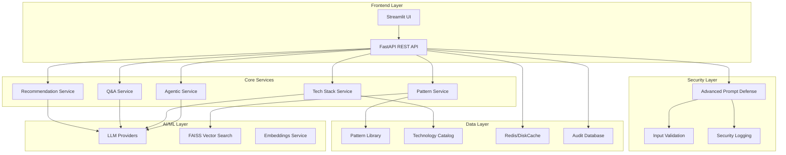

# System Architecture

The Automated AI Assessment (AAA) system is built with a modern, scalable architecture designed for enterprise-grade agentic AI assessment and recommendation.

## High-Level Architecture



## Component Overview

### Frontend Layer

#### Streamlit UI (`streamlit_app.py`)
- Interactive web interface for end users
- Real-time progress tracking and session management
- Advanced diagram viewing with export capabilities
- Pattern and technology catalog management
- System configuration interface

#### FastAPI REST API (`app/api.py`)
- Async REST endpoints for all system operations
- Session management and state persistence
- LLM provider abstraction and routing
- Comprehensive error handling and logging

### Core Services

#### Pattern Service (`app/services/pattern_service.py`)
- Pattern loading, matching, and management
- FAISS-based vector similarity search
- Tag filtering and intelligent ranking
- Pattern analytics and performance tracking

#### Agentic Service (`app/services/agentic_recommendation_service.py`)
- Autonomous agent assessment and scoring
- Multi-agent system design and coordination
- Agentic necessity evaluation
- Exception handling through reasoning

#### Tech Stack Service (`app/services/tech_stack_generator.py`)
- LLM-driven technology recommendations
- Constraint-aware filtering and selection
- Technology categorization and descriptions
- Integration and compliance analysis

#### Q&A Service (`app/qa/question_generator.py`)
- LLM-powered question generation
- Context-aware clarification requests
- Duplicate prevention and caching
- Answer validation and processing

#### Recommendation Service (`app/services/recommendation_service.py`)
- Comprehensive feasibility assessment
- Confidence scoring and analysis
- Implementation guidance generation
- Export and documentation creation

### AI/ML Layer

#### LLM Providers (`app/llm/`)
- Multi-provider support (OpenAI, Anthropic, Bedrock, Internal)
- Provider abstraction and failover
- Rate limiting and performance optimization
- Message logging and audit trails

#### FAISS Vector Search (`app/embeddings/`)
- High-performance similarity search
- Pattern embedding and indexing
- Real-time query processing
- Scalable vector operations

#### Embeddings Service (`app/embeddings/`)
- Text embedding generation using Sentence Transformers
- Vector space optimization and indexing
- Similarity calculation and ranking algorithms
- Performance monitoring and optimization

### Data Layer

#### Pattern Library (`data/patterns/`)
- JSON-based pattern definitions
- Traditional automation patterns (PAT-*)
- Agentic patterns (APAT-*)
- Rich metadata and relationships

#### Technology Catalog (`data/technologies.json`)
- Centralized technology database
- 60+ technologies across 18+ categories
- Rich metadata and relationships
- Automatic updates and curation

#### Caching Layer
- Redis for distributed caching
- DiskCache for local persistence
- Multi-layer caching strategy
- Performance optimization

#### Audit Database (`audit.db`)
- Complete operation logging
- LLM interaction tracking
- Security event recording
- Performance metrics collection

### Security Layer

#### Advanced Prompt Defense (`app/security/`)
- 8 specialized attack detectors
- Multi-language attack detection
- Real-time threat assessment
- User education and guidance

#### Input Validation
- Comprehensive sanitization
- Schema validation and enforcement
- Business logic protection
- Error boundary handling

#### Security Logging
- Structured event logging
- PII redaction and protection
- Audit trail maintenance
- Compliance reporting

## Data Flow

### Analysis Request Flow

1. **Request Ingestion**
   - User submits requirements via UI or API
   - Session creation and state initialization
   - Input validation and sanitization

2. **Q&A Phase**
   - LLM generates contextual questions
   - User provides clarifying answers
   - Answer validation and processing

3. **Pattern Matching**
   - Tag-based filtering of relevant patterns
   - Vector similarity search using FAISS
   - Intelligent ranking and selection

4. **Technology Analysis**
   - LLM-driven tech stack generation
   - Constraint application and filtering
   - Technology categorization and description

5. **Recommendation Generation**
   - Comprehensive feasibility assessment
   - Confidence scoring and analysis
   - Implementation guidance creation

6. **Export and Documentation**
   - Multi-format export generation
   - Diagram creation and rendering
   - Audit trail completion

### Security Processing Flow

1. **Input Reception**
   - Initial request validation
   - Basic sanitization and formatting

2. **Threat Detection**
   - Advanced prompt defense analysis
   - Multi-detector threat assessment
   - Risk scoring and classification

3. **Response Generation**
   - Safe processing continuation
   - User education for violations
   - Audit event logging

## Scalability Considerations

### Horizontal Scaling
- Stateless API design for load balancing
- Redis-based session sharing
- Distributed caching strategy
- Microservice-ready architecture

### Performance Optimization
- Async/await throughout the stack
- Intelligent caching at multiple layers
- Vector search optimization
- Connection pooling and reuse

### Resource Management
- Memory-efficient pattern loading
- Lazy loading of large datasets
- Garbage collection optimization
- Resource monitoring and alerting

## Technology Stack

### Core Technologies
- **Python 3.10+**: Primary development language
- **FastAPI**: High-performance async web framework
- **Streamlit**: Interactive web UI framework
- **Pydantic v2**: Data validation and settings management
- **SQLAlchemy**: Database ORM and query builder

### AI/ML Technologies
- **FAISS**: Vector similarity search engine
- **Sentence Transformers**: Text embedding generation
- **OpenAI/Anthropic APIs**: Large language model access
- **AWS Bedrock**: Enterprise LLM services

### Infrastructure Technologies
- **Redis**: Distributed caching and session storage
- **Docker**: Containerization and deployment
- **Nginx**: Reverse proxy and load balancing
- **PostgreSQL**: Production database (optional)

### Development Technologies
- **pytest**: Testing framework with async support
- **black/ruff**: Code formatting and linting
- **mypy**: Static type checking
- **coverage**: Test coverage reporting

## Deployment Architecture

### Development Environment
```
┌─────────────────┐    ┌─────────────────┐
│   Streamlit UI  │    │   FastAPI API   │
│   Port 8500     │    │   Port 8000     │
└─────────────────┘    └─────────────────┘
         │                       │
         └───────────┬───────────┘
                     │
         ┌─────────────────┐
         │   DiskCache     │
         │   Local Files   │
         └─────────────────┘
```

### Production Environment
```
┌─────────────────┐    ┌─────────────────┐
│   Load Balancer │    │   Nginx Proxy   │
│   (Optional)    │    │   SSL/TLS       │
└─────────────────┘    └─────────────────┘
         │                       │
         └───────────┬───────────┘
                     │
    ┌────────────────┼────────────────┐
    │                │                │
┌─────────────────┐ ┌─────────────────┐ ┌─────────────────┐
│   Streamlit UI  │ │   FastAPI API   │ │   FastAPI API   │
│   Container     │ │   Container 1   │ │   Container 2   │
└─────────────────┘ └─────────────────┘ └─────────────────┘
         │                       │                │
         └───────────┬───────────┼────────────────┘
                     │           │
         ┌─────────────────┐ ┌─────────────────┐
         │   Redis Cache   │ │   PostgreSQL    │
         │   Cluster       │ │   Database      │
         └─────────────────┘ └─────────────────┘
```

## Security Architecture

### Defense in Depth
1. **Network Security**: TLS encryption, firewall rules
2. **Application Security**: Input validation, output encoding
3. **Data Security**: Encryption at rest and in transit
4. **Access Control**: Authentication and authorization
5. **Monitoring**: Real-time threat detection and response

### Threat Model
- **Prompt Injection**: Advanced multi-detector defense
- **Data Exfiltration**: Output sanitization and monitoring
- **Business Logic Bypass**: Validation and access controls
- **Denial of Service**: Rate limiting and resource management

## Monitoring and Observability

### Application Metrics
- Request/response times and throughput
- Error rates and failure patterns
- Resource utilization and performance
- User activity and engagement

### Business Metrics
- Pattern matching accuracy and relevance
- Technology recommendation quality
- User satisfaction and adoption
- System reliability and availability

### Security Metrics
- Attack detection and prevention rates
- Security event frequency and severity
- User education effectiveness
- Compliance and audit readiness

## Future Architecture Considerations

### Microservices Evolution
- Service decomposition strategy
- API gateway implementation
- Service mesh adoption
- Event-driven architecture

### AI/ML Enhancement
- Model fine-tuning and customization
- Real-time learning and adaptation
- Advanced reasoning capabilities
- Multi-modal input processing

### Scalability Improvements
- Auto-scaling and load balancing
- Global distribution and CDN
- Edge computing integration
- Performance optimization