# Service Dependency Documentation

Generated on: 2025-09-19 14:19:12

## Overview

This document provides a comprehensive overview of the service dependency graph for the Automated AI Assessment (AAA) system.

### Summary Statistics

- **Total Services**: 20
- **Total Dependencies**: 41
- **Circular Dependencies**: 0
- **Orphaned Services**: 0
- **Root Services**: 1
- **Leaf Services**: 16

## Service Categories

Services are organized into the following categories:

### Core Services

- **cache**: app.services.cache_service.CacheService
- **config**: app.config.ConfigService
- **logger**: app.utils.logger.AppLogger

### Security Services

- **advanced_prompt_defender**: app.security.advanced_prompt_defender.AdvancedPromptDefender
- **security_validator**: app.security.validation.SecurityValidator

### Llm Services

- **anthropic_provider**: app.llm.claude_provider.ClaudeProvider
- **bedrock_provider**: app.llm.bedrock_provider.BedrockProvider
- **llm_provider_factory**: app.llm.factory.LLMProviderFactory
- **openai_provider**: app.llm.openai_provider.OpenAIProvider

### Diagram Services

- **diagram_service_factory**: app.diagrams.factory.DiagramServiceFactory
- **infrastructure_diagram_service**: app.diagrams.infrastructure.InfrastructureDiagramService
- **mermaid_service**: app.ui.mermaid_diagrams.MermaidService

### Pattern Services

- **pattern_loader**: app.pattern.loader.PatternLoader

### Analysis Services

- **agentic_matcher**: app.pattern.agentic_matcher.AgenticMatcher
- **embedding_engine**: app.embeddings.engine.EmbeddingEngine
- **pattern_matcher**: app.pattern.matcher.PatternMatcher

### Export Services

- **export_service**: app.exporters.service.ExportService

### Monitoring Services

- **health_checker**: app.health.health_checker.HealthChecker
- **performance_monitor**: app.monitoring.performance_monitor.PerformanceMonitor

### Integration Services

- **jira_service**: app.services.jira.JiraService

## Dependency Analysis

### Root Services (No Dependencies)

These services have no dependencies and can be initialized first:

- **config** (core): app.config.ConfigService

### Leaf Services (No Dependents)

These services are not depended upon by other services:

- **advanced_prompt_defender** (security): app.security.advanced_prompt_defender.AdvancedPromptDefender
- **agentic_matcher** (analysis): app.pattern.agentic_matcher.AgenticMatcher
- **anthropic_provider** (llm): app.llm.claude_provider.ClaudeProvider
- **bedrock_provider** (llm): app.llm.bedrock_provider.BedrockProvider
- **diagram_service_factory** (diagram): app.diagrams.factory.DiagramServiceFactory
- **embedding_engine** (analysis): app.embeddings.engine.EmbeddingEngine
- **export_service** (export): app.exporters.service.ExportService
- **health_checker** (monitoring): app.health.health_checker.HealthChecker
- **infrastructure_diagram_service** (diagram): app.diagrams.infrastructure.InfrastructureDiagramService
- **jira_service** (integration): app.services.jira.JiraService
- **mermaid_service** (diagram): app.ui.mermaid_diagrams.MermaidService
- **openai_provider** (llm): app.llm.openai_provider.OpenAIProvider
- **pattern_loader** (pattern): app.pattern.loader.PatternLoader
- **pattern_matcher** (analysis): app.pattern.matcher.PatternMatcher
- **performance_monitor** (monitoring): app.monitoring.performance_monitor.PerformanceMonitor
- **security_validator** (security): app.security.validation.SecurityValidator
## Detailed Service Information

### Service Registry

#### advanced_prompt_defender

- **Type**: app.security.advanced_prompt_defender.AdvancedPromptDefender
- **Category**: security
- **Class Path**: app.security.advanced_prompt_defender.AdvancedPromptDefender
- **Singleton**: Yes
- **Health Check**: Enabled
- **Dependencies**: config, logger, cache
- **Dependents**: None

#### agentic_matcher

- **Type**: app.pattern.agentic_matcher.AgenticMatcher
- **Category**: analysis
- **Class Path**: app.pattern.agentic_matcher.AgenticMatcher
- **Singleton**: Yes
- **Health Check**: Enabled
- **Dependencies**: config, logger, cache, llm_provider_factory
- **Dependents**: None

#### anthropic_provider

- **Type**: app.llm.claude_provider.ClaudeProvider
- **Category**: llm
- **Class Path**: app.llm.claude_provider.ClaudeProvider
- **Singleton**: Yes
- **Health Check**: Enabled
- **Dependencies**: config, logger
- **Dependents**: None

#### bedrock_provider

- **Type**: app.llm.bedrock_provider.BedrockProvider
- **Category**: llm
- **Class Path**: app.llm.bedrock_provider.BedrockProvider
- **Singleton**: Yes
- **Health Check**: Enabled
- **Dependencies**: config, logger
- **Dependents**: None

#### cache

- **Type**: app.services.cache_service.CacheService
- **Category**: core
- **Class Path**: app.services.cache_service.CacheService
- **Singleton**: Yes
- **Health Check**: Enabled
- **Dependencies**: config, logger
- **Dependents**: advanced_prompt_defender, pattern_matcher, agentic_matcher, embedding_engine

#### config

- **Type**: app.config.ConfigService
- **Category**: core
- **Class Path**: app.config.ConfigService
- **Singleton**: Yes
- **Health Check**: Enabled
- **Dependencies**: None
- **Dependents**: logger, cache, security_validator, advanced_prompt_defender, llm_provider_factory, diagram_service_factory, pattern_loader, openai_provider, anthropic_provider, bedrock_provider, pattern_matcher, agentic_matcher, embedding_engine, export_service, mermaid_service, infrastructure_diagram_service, performance_monitor, health_checker, jira_service

#### diagram_service_factory

- **Type**: app.diagrams.factory.DiagramServiceFactory
- **Category**: diagram
- **Class Path**: app.diagrams.factory.DiagramServiceFactory
- **Singleton**: Yes
- **Health Check**: Enabled
- **Dependencies**: config, logger
- **Dependents**: None

#### embedding_engine

- **Type**: app.embeddings.engine.EmbeddingEngine
- **Category**: analysis
- **Class Path**: app.embeddings.engine.EmbeddingEngine
- **Singleton**: Yes
- **Health Check**: Enabled
- **Dependencies**: config, logger, cache
- **Dependents**: None

#### export_service

- **Type**: app.exporters.service.ExportService
- **Category**: export
- **Class Path**: app.exporters.service.ExportService
- **Singleton**: Yes
- **Health Check**: Enabled
- **Dependencies**: config, logger
- **Dependents**: None

#### health_checker

- **Type**: app.health.health_checker.HealthChecker
- **Category**: monitoring
- **Class Path**: app.health.health_checker.HealthChecker
- **Singleton**: Yes
- **Health Check**: Enabled
- **Dependencies**: config, logger
- **Dependents**: None

#### infrastructure_diagram_service

- **Type**: app.diagrams.infrastructure.InfrastructureDiagramService
- **Category**: diagram
- **Class Path**: app.diagrams.infrastructure.InfrastructureDiagramService
- **Singleton**: Yes
- **Health Check**: Enabled
- **Dependencies**: config, logger
- **Dependents**: None

#### jira_service

- **Type**: app.services.jira.JiraService
- **Category**: integration
- **Class Path**: app.services.jira.JiraService
- **Singleton**: Yes
- **Health Check**: Enabled
- **Dependencies**: config, logger
- **Dependents**: None

#### llm_provider_factory

- **Type**: app.llm.factory.LLMProviderFactory
- **Category**: llm
- **Class Path**: app.llm.factory.LLMProviderFactory
- **Singleton**: No
- **Health Check**: Enabled
- **Dependencies**: config, logger
- **Dependents**: agentic_matcher

#### logger

- **Type**: app.utils.logger.AppLogger
- **Category**: core
- **Class Path**: app.utils.logger.AppLogger
- **Singleton**: Yes
- **Health Check**: Enabled
- **Dependencies**: config
- **Dependents**: cache, security_validator, advanced_prompt_defender, llm_provider_factory, diagram_service_factory, openai_provider, anthropic_provider, bedrock_provider, pattern_matcher, agentic_matcher, embedding_engine, export_service, mermaid_service, infrastructure_diagram_service, performance_monitor, health_checker, jira_service

#### mermaid_service

- **Type**: app.ui.mermaid_diagrams.MermaidService
- **Category**: diagram
- **Class Path**: app.ui.mermaid_diagrams.MermaidService
- **Singleton**: Yes
- **Health Check**: Enabled
- **Dependencies**: config, logger
- **Dependents**: None

#### openai_provider

- **Type**: app.llm.openai_provider.OpenAIProvider
- **Category**: llm
- **Class Path**: app.llm.openai_provider.OpenAIProvider
- **Singleton**: Yes
- **Health Check**: Enabled
- **Dependencies**: config, logger
- **Dependents**: None

#### pattern_loader

- **Type**: app.pattern.loader.PatternLoader
- **Category**: pattern
- **Class Path**: app.pattern.loader.PatternLoader
- **Singleton**: Yes
- **Health Check**: Enabled
- **Dependencies**: config
- **Dependents**: None

#### pattern_matcher

- **Type**: app.pattern.matcher.PatternMatcher
- **Category**: analysis
- **Class Path**: app.pattern.matcher.PatternMatcher
- **Singleton**: Yes
- **Health Check**: Enabled
- **Dependencies**: config, logger, cache
- **Dependents**: None

#### performance_monitor

- **Type**: app.monitoring.performance_monitor.PerformanceMonitor
- **Category**: monitoring
- **Class Path**: app.monitoring.performance_monitor.PerformanceMonitor
- **Singleton**: Yes
- **Health Check**: Enabled
- **Dependencies**: config, logger
- **Dependents**: None

#### security_validator

- **Type**: app.security.validation.SecurityValidator
- **Category**: security
- **Class Path**: app.security.validation.SecurityValidator
- **Singleton**: Yes
- **Health Check**: Enabled
- **Dependencies**: config, logger
- **Dependents**: None

## Recommended Initialization Order

Based on the dependency analysis, services should be initialized in the following order:

1. **advanced_prompt_defender** (security)
2. **agentic_matcher** (analysis)
3. **anthropic_provider** (llm)
4. **bedrock_provider** (llm)
5. **diagram_service_factory** (diagram)
6. **embedding_engine** (analysis)
7. **export_service** (export)
8. **health_checker** (monitoring)
9. **infrastructure_diagram_service** (diagram)
10. **jira_service** (integration)
11. **mermaid_service** (diagram)
12. **openai_provider** (llm)
13. **pattern_loader** (pattern)
14. **pattern_matcher** (analysis)
15. **performance_monitor** (monitoring)
16. **security_validator** (security)

## Diagrams

### Mermaid Diagram

```mermaid
graph TD
    logger[Logger]
    config[Config]
    cache[Cache]
    security_validator[Security Validator]
    advanced_prompt_defender[Advanced Prompt Defender]
    llm_provider_factory(Llm Provider Factory)
    diagram_service_factory[Diagram Service Factory]
    pattern_loader[Pattern Loader]
    openai_provider[Openai Provider]
    anthropic_provider[Anthropic Provider]
    bedrock_provider[Bedrock Provider]
    pattern_matcher[Pattern Matcher]
    agentic_matcher[Agentic Matcher]
    embedding_engine[Embedding Engine]
    export_service[Export Service]
    mermaid_service[Mermaid Service]
    infrastructure_diagram_service[Infrastructure Diagram Service]
    performance_monitor[Performance Monitor]
    health_checker[Health Checker]
    jira_service[Jira Service]
    logger --> config
    cache --> config
    cache --> logger
    security_validator --> config
    security_validator --> logger
    advanced_prompt_defender --> config
    advanced_prompt_defender --> logger
    advanced_prompt_defender --> cache
    llm_provider_factory --> config
    llm_provider_factory --> logger
    diagram_service_factory --> config
    diagram_service_factory --> logger
    pattern_loader --> config
    openai_provider --> config
    openai_provider --> logger
    anthropic_provider --> config
    anthropic_provider --> logger
    bedrock_provider --> config
    bedrock_provider --> logger
    pattern_matcher --> config
    pattern_matcher --> logger
    pattern_matcher --> cache
    agentic_matcher --> config
    agentic_matcher --> logger
    agentic_matcher --> cache
    agentic_matcher --> llm_provider_factory
    embedding_engine --> config
    embedding_engine --> logger
    embedding_engine --> cache
    export_service --> config
    export_service --> logger
    mermaid_service --> config
    mermaid_service --> logger
    infrastructure_diagram_service --> config
    infrastructure_diagram_service --> logger
    performance_monitor --> config
    performance_monitor --> logger
    health_checker --> config
    health_checker --> logger
    jira_service --> config
    jira_service --> logger

    classDef coreStyle fill:#e1f5fe,stroke:#01579b,stroke-width:2px
    class logger coreStyle
    classDef coreStyle fill:#e1f5fe,stroke:#01579b,stroke-width:2px
    class config coreStyle
    classDef coreStyle fill:#e1f5fe,stroke:#01579b,stroke-width:2px
    class cache coreStyle
    classDef securityStyle fill:#fff3e0,stroke:#e65100,stroke-width:2px
    class security_validator securityStyle
    classDef securityStyle fill:#fff3e0,stroke:#e65100,stroke-width:2px
    class advanced_prompt_defender securityStyle
    classDef llmStyle fill:#f3e5f5,stroke:#4a148c,stroke-width:2px
    class llm_provider_factory llmStyle
    classDef llmStyle fill:#f3e5f5,stroke:#4a148c,stroke-width:2px
    class openai_provider llmStyle
    classDef llmStyle fill:#f3e5f5,stroke:#4a148c,stroke-width:2px
    class anthropic_provider llmStyle
    classDef llmStyle fill:#f3e5f5,stroke:#4a148c,stroke-width:2px
    class bedrock_provider llmStyle
    classDef diagramStyle fill:#e8f5e8,stroke:#1b5e20,stroke-width:2px
    class diagram_service_factory diagramStyle
    classDef diagramStyle fill:#e8f5e8,stroke:#1b5e20,stroke-width:2px
    class mermaid_service diagramStyle
    classDef diagramStyle fill:#e8f5e8,stroke:#1b5e20,stroke-width:2px
    class infrastructure_diagram_service diagramStyle
    classDef analysisStyle fill:#fff8e1,stroke:#ff6f00,stroke-width:2px
    class pattern_matcher analysisStyle
    classDef analysisStyle fill:#fff8e1,stroke:#ff6f00,stroke-width:2px
    class agentic_matcher analysisStyle
    classDef analysisStyle fill:#fff8e1,stroke:#ff6f00,stroke-width:2px
    class embedding_engine analysisStyle
    classDef exportStyle fill:#fce4ec,stroke:#880e4f,stroke-width:2px
    class export_service exportStyle
    classDef monitoringStyle fill:#f1f8e9,stroke:#33691e,stroke-width:2px
    class performance_monitor monitoringStyle
    classDef monitoringStyle fill:#f1f8e9,stroke:#33691e,stroke-width:2px
    class health_checker monitoringStyle
    classDef integrationStyle fill:#e0f2f1,stroke:#00695c,stroke-width:2px
    class jira_service integrationStyle
    classDef patternStyle fill:#f9fbe7,stroke:#827717,stroke-width:2px
    class pattern_loader patternStyle
```



### Graphviz Diagram

A Graphviz DOT file is available at: `docs/architecture/dependencies/service_dependency_graph.dot`

To generate a visual diagram:

```bash
dot -Tpng service_dependency_graph.dot -o service_dependency_graph.png
```
