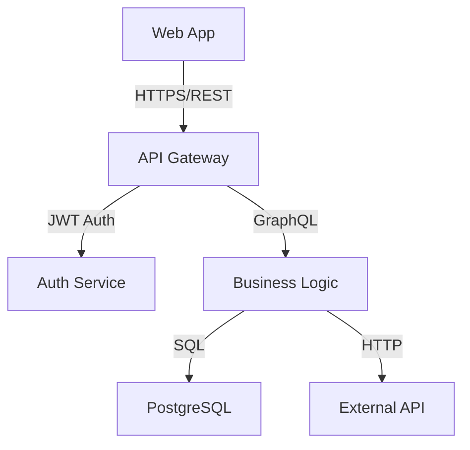
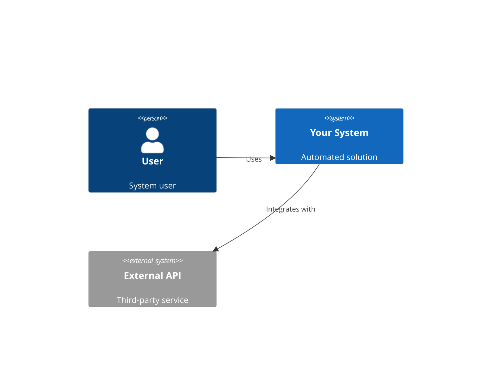
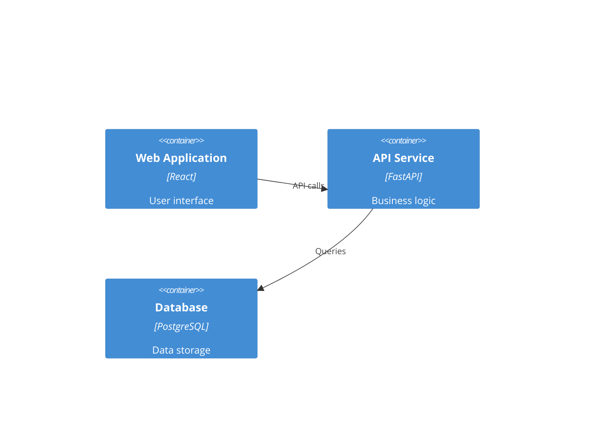
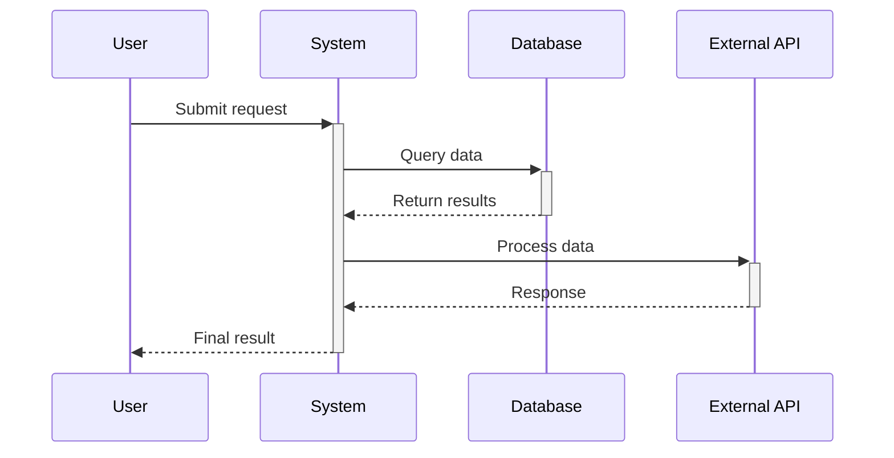
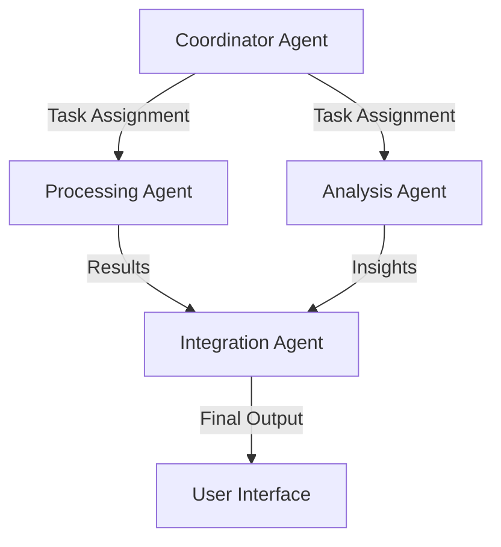

# Alternatives to Infrastructure Diagrams (No Graphviz Required)

## Overview

If you can't install Graphviz, you have excellent alternatives that are often **more useful** than Infrastructure Diagrams. This guide shows you how to get comprehensive architectural insights without Graphviz.

## Recommended Workflow (No Graphviz Needed)

### Step 1: Generate Tech Stack Wiring Diagram 🔌

**What it shows:** How your recommended technologies connect and communicate

**Why it's better than Infrastructure:** 
- Shows actual API calls, database connections, authentication flows
- More developer-focused and actionable
- Displays data flow between components
- Works on any system

**Example output:**


### Step 2: Generate Context Diagram 🌐

**What it shows:** System boundaries and external integrations

**Perfect for:** Understanding what your system connects to

**Example output:**


### Step 3: Generate Container Diagram 📦

**What it shows:** Internal components and services

**Perfect for:** Understanding system architecture

**Example output:**


### Step 4: Generate Sequence Diagram 🔄

**What it shows:** Step-by-step process flow

**Perfect for:** Understanding workflows and automation steps

**Example output:**


## Complete Architecture Documentation (No Graphviz)

By combining these 4 diagram types, you get **more comprehensive** documentation than Infrastructure Diagrams alone:

| Diagram Type | Purpose | Shows |
|--------------|---------|-------|
| **Tech Stack Wiring** | Technical Implementation | API calls, data flow, authentication |
| **Context** | System Boundaries | External integrations, users |
| **Container** | Internal Architecture | Services, components, databases |
| **Sequence** | Process Flow | Step-by-step workflows |

## For AI/Agent Systems: Add Agent Interaction Diagram 🤖

If your system uses AI agents, also generate:

**Agent Interaction Diagram:** Shows how AI agents communicate and coordinate

**Example output:**


## Docker Alternative (Includes Graphviz)

If you can use Docker, everything is pre-configured:

```bash
# Clone repository
git clone <repository-url>
cd agentic_or_not

# Run with Docker (includes Graphviz)
docker-compose up

# Access at http://localhost:8500
```

The Docker environment includes:
- ✅ Graphviz pre-installed
- ✅ All Python dependencies
- ✅ Complete AAA system
- ✅ Infrastructure Diagrams work out of the box

## Export Options for External Tools

### 1. JSON Specification Export

Even without Graphviz, you can:
1. Generate infrastructure specification (JSON format)
2. Export the specification
3. Use it with external tools:

**Popular external tools:**
- **Draw.io** (free): Import JSON, create diagrams
- **Lucidchart**: Professional diagramming
- **CloudCraft**: AWS-specific architecture diagrams
- **Visio**: Microsoft diagramming software

### 2. Generated Python Code

You can also:
1. View the generated Python code for infrastructure diagrams
2. Modify it for your needs
3. Run it on a system that has Graphviz
4. Share with team members who have Graphviz

## Cloud Provider Tools

### AWS Users
- **AWS Architecture Center**: Free architecture tools
- **AWS Workload Discovery**: Automatic architecture discovery
- **CloudFormation Designer**: Visual template designer

### Azure Users  
- **Azure Architecture Center**: Microsoft's architecture tools
- **Azure Resource Manager**: Template visualization
- **Azure DevOps**: Architecture documentation

### GCP Users
- **GCP Architecture Framework**: Google's architecture tools
- **Cloud Deployment Manager**: Template visualization
- **Cloud Console**: Resource visualization

## Comparison: Infrastructure vs Alternatives

| Feature | Infrastructure Diagram | Tech Stack Wiring | Context + Container |
|---------|----------------------|-------------------|-------------------|
| **Graphviz Required** | ❌ Yes | ✅ No | ✅ No |
| **Shows Technology Connections** | ⚠️ Limited | ✅ Detailed | ✅ Yes |
| **Shows Data Flow** | ⚠️ Basic | ✅ Comprehensive | ✅ Yes |
| **Developer Actionable** | ⚠️ Limited | ✅ High | ✅ High |
| **Industry Standard** | ⚠️ Tool-specific | ✅ Mermaid | ✅ C4 Model |
| **Works Everywhere** | ❌ No | ✅ Yes | ✅ Yes |

## Recommendation

**Best approach without Graphviz:**

1. **Start with Tech Stack Wiring Diagram** - Most practical for developers
2. **Add Context Diagram** - Shows system boundaries  
3. **Add Container Diagram** - Shows internal architecture
4. **Add Sequence Diagram** - Shows process flow
5. **For AI systems: Add Agent Interaction Diagram**

This gives you **more comprehensive** architectural documentation than Infrastructure Diagrams alone, and works on any system without additional dependencies.

## Getting Started

1. Open AAA application
2. Complete your requirements analysis
3. Go to "Diagrams" tab
4. Generate these diagrams in order:
   - Tech Stack Wiring Diagram
   - Context Diagram  
   - Container Diagram
   - Sequence Diagram
5. Export or screenshot for documentation

You'll have complete architectural documentation without needing Graphviz!