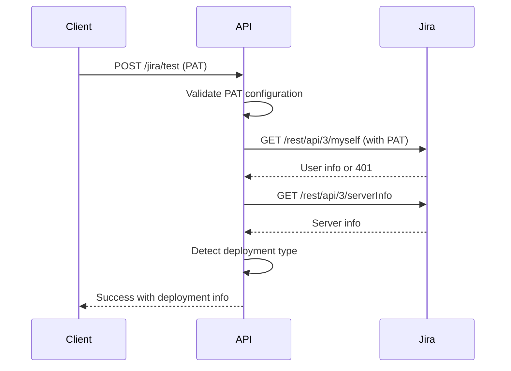
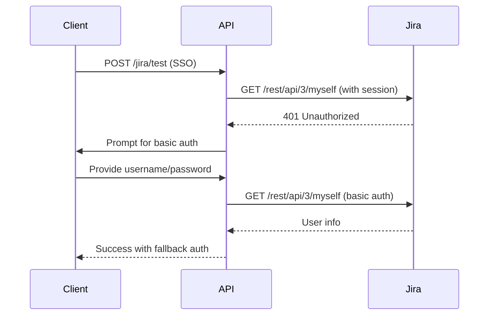
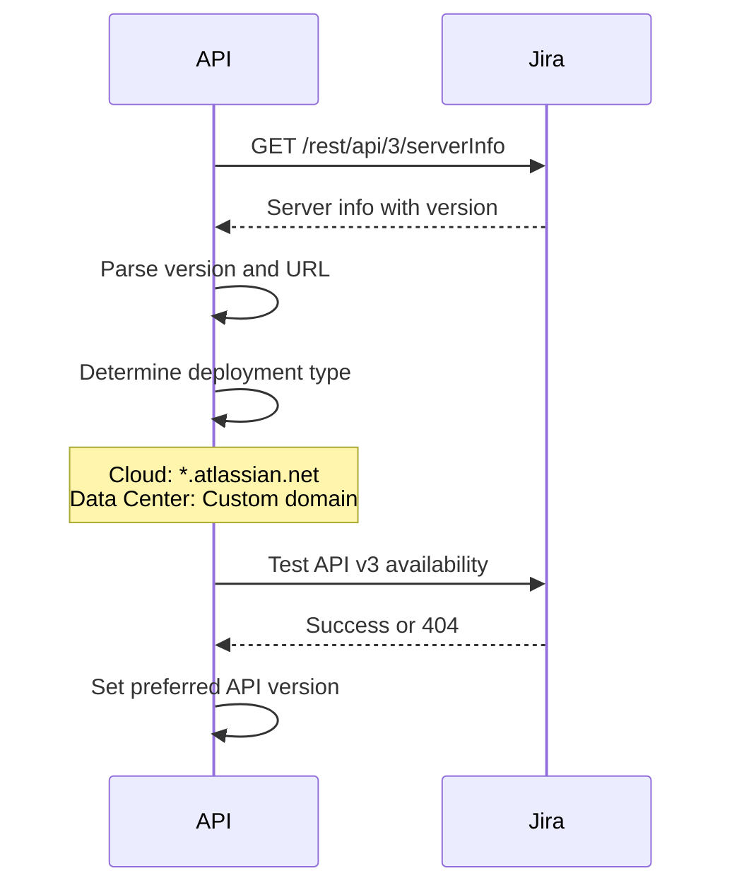

# Jira Data Center API Documentation

This document provides comprehensive API documentation for Jira Data Center integration endpoints in the AAA system, including request/response models, authentication flows, and usage examples.

## Table of Contents

1. [Overview](#overview)
2. [Authentication](#authentication)
3. [API Endpoints](#api-endpoints)
4. [Request/Response Models](#requestresponse-models)
5. [Error Handling](#error-handling)
6. [Usage Examples](#usage-examples)
7. [Authentication Flows](#authentication-flows)
8. [Backward Compatibility](#backward-compatibility)

## Overview

The AAA system provides two main Jira integration endpoints that support both Jira Cloud and Jira Data Center 9.12.22:

- **`POST /jira/test`**: Test Jira connection with authentication fallback
- **`POST /jira/fetch`**: Fetch Jira ticket data with API version detection

Both endpoints feature:
- Automatic deployment type detection (Cloud vs Data Center)
- Multiple authentication methods with fallback support
- Enhanced error handling with troubleshooting guidance
- API version detection and fallback (v3 → v2)
- Network configuration support (SSL, proxy, timeouts)

## Authentication

### Supported Authentication Methods

| Method | Jira Cloud | Jira Data Center | Description |
|--------|------------|------------------|-------------|
| `api_token` | ✅ Yes | ❌ No | Email + API Token (Cloud only) |
| `pat` | ❌ No | ✅ Yes | Personal Access Token (Data Center) |
| `sso` | ❌ No | ✅ Yes | Single Sign-On with session cookies |
| `basic` | ❌ No | ✅ Yes | Username + Password (fallback only) |

### Authentication Configuration

Each authentication method requires specific fields:

#### API Token (Jira Cloud)
```json
{
  "auth_type": "api_token",
  "email": "user@company.com",
  "api_token": "ATATT3xFfGF0..."
}
```

#### Personal Access Token (Jira Data Center)
```json
{
  "auth_type": "pat",
  "personal_access_token": "NjE2NTc2NzI2..."
}
```

#### SSO Authentication (Jira Data Center)
```json
{
  "auth_type": "sso",
  "use_sso": true,
  "sso_session_cookie": "JSESSIONID=..."
}
```

#### Basic Authentication (Jira Data Center - Fallback)
```json
{
  "auth_type": "basic",
  "username": "jdoe",
  "password": "secure-password"
}
```

## API Endpoints

### POST /jira/test

Test Jira connection with enhanced Data Center support and authentication fallback.

#### Request Model: `JiraTestRequest`

```json
{
  "base_url": "https://jira.yourcompany.com",
  "auth_type": "pat",
  "personal_access_token": "your-pat-token",
  
  // Network Configuration (optional)
  "verify_ssl": true,
  "ca_cert_path": "/path/to/ca-bundle.crt",
  "proxy_url": "http://proxy.company.com:8080",
  "timeout": 30,
  
  // SSO Configuration (optional)
  "use_sso": false,
  "sso_session_cookie": null,
  
  // Data Center Configuration (optional)
  "context_path": "/jira",
  "custom_port": 8443,
  
  // Retry Configuration (optional)
  "max_retries": 3,
  "retry_delay": 1.0
}
```

#### Response Model: `JiraTestResponse`

**Success Response:**
```json
{
  "ok": true,
  "message": "Jira connection successful",
  "deployment_info": {
    "deployment_type": "data_center",
    "version": "9.12.22",
    "build_number": "912022",
    "base_url_normalized": "https://jira.yourcompany.com",
    "context_path": null,
    "supports_sso": true,
    "supports_pat": true
  },
  "auth_methods_available": ["pat", "sso", "basic"],
  "api_version_detected": "3"
}
```

**Error Response:**
```json
{
  "ok": false,
  "message": "Authentication failed: Invalid token",
  "error_details": {
    "error_type": "authentication_error",
    "error_code": "401",
    "message": "Invalid token",
    "troubleshooting_steps": [
      "Verify authentication credentials are correct",
      "Check if the user account has necessary permissions",
      "For PAT: verify token has required scopes"
    ],
    "documentation_links": [
      "https://confluence.atlassian.com/enterprise/using-personal-access-tokens-1026032365.html"
    ],
    "suggested_config_changes": {
      "auth_type": "sso"
    }
  },
  "auth_methods_available": [],
  "api_version_detected": null
}
```

### POST /jira/fetch

Fetch Jira ticket with enhanced Data Center support and API version detection.

#### Request Model: `JiraFetchRequest`

Extends `JiraTestRequest` with additional field:

```json
{
  "base_url": "https://jira.yourcompany.com",
  "auth_type": "pat",
  "personal_access_token": "your-pat-token",
  "ticket_key": "PROJECT-123",
  
  // All JiraTestRequest fields are also supported
  "verify_ssl": true,
  "timeout": 30
}
```

#### Response Model: `JiraFetchResponse`

```json
{
  "ticket_data": {
    "key": "PROJECT-123",
    "summary": "Implement user authentication",
    "description": "Add OAuth2 authentication to the application",
    "status": "In Progress",
    "priority": "High",
    "assignee": "John Doe",
    "reporter": "Jane Smith",
    "created": "2024-01-15T10:30:00.000Z",
    "updated": "2024-01-16T14:20:00.000Z",
    "project": {
      "key": "PROJECT",
      "name": "My Project"
    },
    "issue_type": "Story",
    "custom_fields": {}
  },
  "requirements": {
    "description": "Add OAuth2 authentication to the application",
    "domain": "authentication",
    "priority": "high",
    "complexity": "medium",
    "source": "jira",
    "source_id": "PROJECT-123"
  },
  "deployment_info": {
    "deployment_type": "data_center",
    "version": "9.12.22",
    "build_number": "912022",
    "base_url_normalized": "https://jira.yourcompany.com"
  },
  "api_version_used": "3"
}
```

## Request/Response Models

### JiraTestRequest

| Field | Type | Required | Description |
|-------|------|----------|-------------|
| `base_url` | string | ✅ | Jira instance URL |
| `auth_type` | string | ✅ | Authentication method: `api_token`, `pat`, `sso`, `basic` |
| `email` | string | ⚠️ | Required for `api_token` |
| `api_token` | string | ⚠️ | Required for `api_token` |
| `username` | string | ⚠️ | Required for `basic` |
| `password` | string | ⚠️ | Required for `basic` |
| `personal_access_token` | string | ⚠️ | Required for `pat` |
| `verify_ssl` | boolean | ❌ | SSL certificate verification (default: true) |
| `ca_cert_path` | string | ❌ | Path to custom CA certificate bundle |
| `proxy_url` | string | ❌ | HTTP/HTTPS proxy URL |
| `timeout` | integer | ❌ | Request timeout in seconds (default: 30) |
| `use_sso` | boolean | ❌ | Enable SSO authentication (default: false) |
| `sso_session_cookie` | string | ❌ | SSO session cookie |
| `context_path` | string | ❌ | Custom context path (e.g., "/jira") |
| `custom_port` | integer | ❌ | Custom port number |
| `max_retries` | integer | ❌ | Maximum retry attempts (default: 3) |
| `retry_delay` | float | ❌ | Retry delay in seconds (default: 1.0) |

### JiraTestResponse

| Field | Type | Description |
|-------|------|-------------|
| `ok` | boolean | Success status |
| `message` | string | Response message |
| `deployment_info` | object | Detected deployment information |
| `error_details` | object | Detailed error information (if failed) |
| `auth_methods_available` | array | Available authentication methods |
| `api_version_detected` | string | Detected API version |

### JiraFetchRequest

Extends `JiraTestRequest` with:

| Field | Type | Required | Description |
|-------|------|----------|-------------|
| `ticket_key` | string | ✅ | Jira ticket key (e.g., "PROJECT-123") |

### JiraFetchResponse

| Field | Type | Description |
|-------|------|-------------|
| `ticket_data` | object | Complete Jira ticket data |
| `requirements` | object | Mapped requirements for AAA system |
| `deployment_info` | object | Deployment information |
| `api_version_used` | string | API version used for fetching |

### JiraErrorDetail

| Field | Type | Description |
|-------|------|-------------|
| `error_type` | string | Error category |
| `error_code` | string | HTTP or Jira error code |
| `message` | string | Error message |
| `troubleshooting_steps` | array | Step-by-step troubleshooting guide |
| `documentation_links` | array | Relevant documentation URLs |
| `suggested_config_changes` | object | Suggested configuration modifications |

## Error Handling

### Error Types

| Error Type | Description | Common Causes |
|------------|-------------|---------------|
| `configuration_error` | Invalid configuration | Missing required fields, invalid values |
| `connection_error` | Network connectivity issues | Firewall, DNS, proxy problems |
| `authentication_error` | Authentication failures | Invalid credentials, expired tokens |
| `authorization_error` | Permission issues | Insufficient user permissions |
| `api_error` | Jira API errors | Invalid ticket key, API limitations |
| `ssl_error` | SSL certificate issues | Self-signed certs, invalid CA |
| `timeout_error` | Request timeouts | Network latency, server overload |
| `unexpected_error` | Unexpected system errors | System bugs, resource issues |

### Error Response Structure

All error responses include:
- **Error Type**: Categorization for programmatic handling
- **Error Message**: Human-readable description
- **Troubleshooting Steps**: Actionable resolution steps
- **Documentation Links**: Relevant help resources
- **Suggested Config Changes**: Recommended configuration modifications

### Common Error Scenarios

#### SSL Certificate Error
```json
{
  "error_type": "ssl_error",
  "message": "SSL: CERTIFICATE_VERIFY_FAILED",
  "troubleshooting_steps": [
    "For internal CA: provide ca_cert_path in configuration",
    "For self-signed certs: set verify_ssl to false (development only)",
    "Verify certificate chain is complete"
  ],
  "suggested_config_changes": {
    "ca_cert_path": "/path/to/ca-bundle.crt"
  }
}
```

#### Authentication Error
```json
{
  "error_type": "authentication_error",
  "error_code": "401",
  "message": "Invalid Personal Access Token",
  "troubleshooting_steps": [
    "Verify PAT token is correct and not expired",
    "Check token permissions in Jira Data Center",
    "Try regenerating the token"
  ],
  "documentation_links": [
    "https://confluence.atlassian.com/enterprise/using-personal-access-tokens-1026032365.html"
  ]
}
```

## Usage Examples

### Basic Data Center Connection Test

```bash
curl -X POST "http://localhost:8000/jira/test" \
  -H "Content-Type: application/json" \
  -d '{
    "base_url": "https://jira.yourcompany.com",
    "auth_type": "pat",
    "personal_access_token": "NjE2NTc2NzI2..."
  }'
```

### Enterprise Network Configuration

```bash
curl -X POST "http://localhost:8000/jira/test" \
  -H "Content-Type: application/json" \
  -d '{
    "base_url": "https://jira.yourcompany.com:8443",
    "auth_type": "pat",
    "personal_access_token": "your-pat-token",
    "verify_ssl": true,
    "ca_cert_path": "/etc/ssl/certs/company-ca.crt",
    "proxy_url": "http://proxy.company.com:8080",
    "timeout": 60,
    "context_path": "/jira",
    "custom_port": 8443
  }'
```

### SSO Authentication

```bash
curl -X POST "http://localhost:8000/jira/test" \
  -H "Content-Type: application/json" \
  -d '{
    "base_url": "https://jira.yourcompany.com",
    "auth_type": "sso",
    "use_sso": true,
    "sso_session_cookie": "JSESSIONID=ABC123..."
  }'
```

### Fetch Ticket with Data Center

```bash
curl -X POST "http://localhost:8000/jira/fetch" \
  -H "Content-Type: application/json" \
  -d '{
    "base_url": "https://jira.yourcompany.com",
    "auth_type": "pat",
    "personal_access_token": "your-pat-token",
    "ticket_key": "PROJECT-123",
    "timeout": 30
  }'
```

### Python Client Example

```python
import requests
import json

# Configuration
jira_config = {
    "base_url": "https://jira.yourcompany.com",
    "auth_type": "pat",
    "personal_access_token": "your-pat-token",
    "verify_ssl": True,
    "timeout": 30
}

# Test connection
def test_jira_connection():
    response = requests.post(
        "http://localhost:8000/jira/test",
        json=jira_config,
        headers={"Content-Type": "application/json"}
    )
    
    result = response.json()
    
    if result["ok"]:
        print(f"✅ Connection successful!")
        print(f"Deployment: {result['deployment_info']['deployment_type']}")
        print(f"Version: {result['deployment_info']['version']}")
        print(f"API Version: {result['api_version_detected']}")
        print(f"Available Auth Methods: {result['auth_methods_available']}")
    else:
        print(f"❌ Connection failed: {result['message']}")
        if result.get("error_details"):
            print("Troubleshooting steps:")
            for step in result["error_details"]["troubleshooting_steps"]:
                print(f"  - {step}")

# Fetch ticket
def fetch_ticket(ticket_key):
    config = jira_config.copy()
    config["ticket_key"] = ticket_key
    
    response = requests.post(
        "http://localhost:8000/jira/fetch",
        json=config,
        headers={"Content-Type": "application/json"}
    )
    
    if response.status_code == 200:
        result = response.json()
        print(f"✅ Ticket fetched: {result['ticket_data']['key']}")
        print(f"Summary: {result['ticket_data']['summary']}")
        print(f"API Version Used: {result['api_version_used']}")
        return result
    else:
        print(f"❌ Failed to fetch ticket: {response.status_code}")
        print(response.text)
        return None

# Usage
if __name__ == "__main__":
    test_jira_connection()
    fetch_ticket("PROJECT-123")
```

## Authentication Flows

### 1. Personal Access Token Flow



### 2. SSO with Fallback Flow



### 3. Automatic Deployment Detection



## Backward Compatibility

### Cloud Configuration Support

Existing Jira Cloud configurations continue to work without changes:

```json
{
  "base_url": "https://yourcompany.atlassian.net",
  "auth_type": "api_token",
  "email": "user@company.com",
  "api_token": "ATATT3xFfGF0..."
}
```

### Migration Path

The system provides automatic migration support:

1. **Automatic Detection**: Deployment type is detected from URL
2. **Graceful Fallback**: API version fallback (v3 → v2)
3. **Configuration Validation**: Clear error messages for invalid configs
4. **Backward Compatibility**: All existing integrations continue to work

### Version Compatibility Matrix

| Jira Version | API v2 | API v3 | Supported |
|--------------|--------|--------|-----------|
| Cloud (Current) | ✅ | ✅ | ✅ Full |
| Data Center 9.12.22 | ✅ | ✅ | ✅ Full |
| Data Center 9.x | ✅ | ⚠️ | ✅ With fallback |
| Data Center 8.x | ✅ | ❌ | ✅ API v2 only |
| Server 8.x | ✅ | ❌ | ✅ API v2 only |

## OpenAPI Schema

The complete OpenAPI schema is available at:
- **Swagger UI**: http://localhost:8000/docs
- **ReDoc**: http://localhost:8000/redoc
- **OpenAPI JSON**: http://localhost:8000/openapi.json

### Key Schema Updates for Data Center

1. **Enhanced Request Models**: Added Data Center specific fields
2. **Detailed Error Responses**: Comprehensive error handling with troubleshooting
3. **Deployment Info**: Automatic deployment detection and reporting
4. **Authentication Methods**: Support for multiple authentication types
5. **Network Configuration**: SSL, proxy, and timeout configuration options

This API documentation provides comprehensive guidance for integrating with both Jira Cloud and Data Center instances through the AAA system's enhanced Jira endpoints.