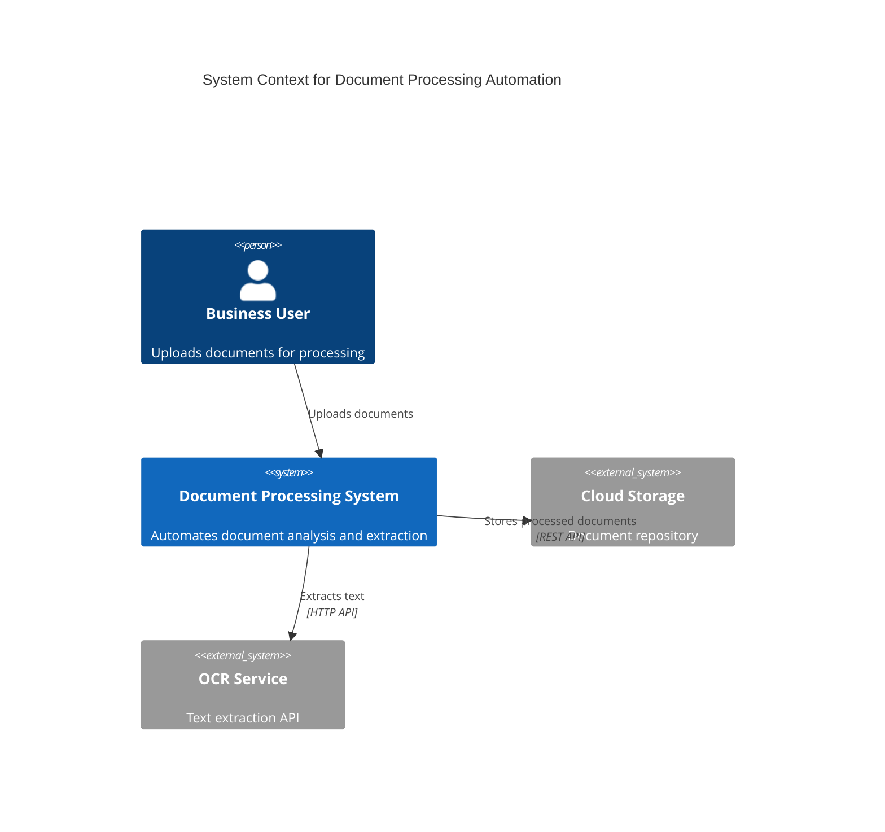

# Automated AI Assessment (AAA) Streamlit UI

This is the Streamlit web interface for the Automated AI Assessment (AAA) application, which helps assess automation feasibility of business requirements using AI.

## Features

### 📝 Input Methods
- **Text Input**: Direct text entry with optional domain and pattern type selection
- **File Upload**: Support for TXT, DOCX, JSON, and CSV files
- **Jira Integration**: Fetch requirements directly from Jira tickets (requires task 10 implementation)

### 🤖 Provider Configuration
- **Multiple LLM Providers**: OpenAI, AWS Bedrock, Anthropic Claude, Internal HTTP, FakeLLM
- **Explicit Provider Selection**: Choose FakeLLM for testing or real providers for production
- **Live Provider Switching**: Change providers without losing session state
- **Connection Testing**: Validate provider credentials and connectivity
- **Model Selection**: Choose from available models for each provider

### 📊 Progress Tracking
- **Real-time Progress**: Visual progress bar with phase indicators
- **Phase Descriptions**: Clear explanations of current processing phase
- **Auto-refresh**: Automatic polling for status updates

### ❓ AI-Powered Q&A
- **AI-Generated Questions**: LLM creates contextual questions based on your specific requirement
- **Smart Question Focus**: Questions target physical vs digital, data sources, and complexity
- **Submit Button Interface**: Batch answer submission to prevent constant API calls
- **Intelligent Completion**: System determines when sufficient information is gathered

### 🎯 Results Display
- **Feasibility Assessment**: Clear Yes/Partial/No feasibility indication
- **Pattern Matches**: Detailed breakdown of matching solution patterns
- **Tech Stack Recommendations**: Suggested technologies for implementation
- **Confidence Scores**: Numerical confidence ratings for each recommendation

### 📤 Export Functionality
- **JSON Export**: Machine-readable format for integration
- **Markdown Export**: Human-readable format for documentation
- **Download Links**: Direct file download capabilities

### 📊 AI-Generated Architecture Diagrams
- **Context Diagrams**: System boundaries and external integrations tailored to your requirement
- **Container Diagrams**: Internal components and data flow specific to your solution
- **Sequence Diagrams**: Step-by-step process flow with decision points and alternatives
- **C4 Diagrams**: Proper C4 architecture model using standardized C4 syntax, boundaries, and relationship conventions following the official C4 modeling approach
- **Enhanced Viewing**: Browser export, interactive controls, SVG download
- **Mermaid Integration**: Interactive diagram rendering with code viewing and editing

### 📚 Pattern Library Management
- **View Patterns**: Browse all solution patterns with filtering and search
- **Edit Patterns**: Modify existing patterns with validation and backup
- **Create Patterns**: Add new patterns with guided forms and auto-generated IDs
- **Delete Patterns**: Remove patterns with confirmation and backup preservation
- **Pattern Statistics**: Real-time overview of pattern distribution and usage
- **Pattern Type Filtering**: Filter by automation approach tags

### 📈 Enhanced Observability
- **Provider Metrics**: LLM performance tracking with time-based filtering
- **Usage Analytics**: Pattern matching statistics and success rates
- **LLM Message Tracking**: Complete audit trail of AI interactions
- **Admin Tools**: Database cleanup, export functionality, test data management
- **Real-time Monitoring**: Current session and historical data analysis

## Usage

### Starting the Application

#### Quick Start (Recommended)
```bash
# Start both API and UI together (opens browser automatically)
make dev
```

#### Individual Services
1. **Start the FastAPI backend**:
   ```bash
   make api
   # or
   python3 -m uvicorn app.api:app --reload --host 0.0.0.0 --port 8000
   ```

2. **Start the Streamlit UI**:
   ```bash
   make streamlit  # Opens browser automatically
   # or
   make ui
   # or
   python3 run_streamlit.py
   ```

3. **Access the application**:
   - The browser should open automatically to `http://localhost:8500`
   - Ensure the API is running at `http://localhost:8000`
   - If browser doesn't open, manually visit `http://localhost:8500`

### Basic Workflow

1. **Configure Provider** (Sidebar):
   - Select your preferred LLM provider
   - Enter API credentials
   - Test the connection

2. **Submit Requirements** (Analysis Tab):
   - Choose input method (text, file, or Jira)
   - Enter or upload your requirements
   - Click "Analyze Requirements"

3. **Monitor Progress**:
   - Watch the progress bar advance through phases
   - Answer any clarifying questions that appear

4. **Review Results**:
   - Examine feasibility assessment
   - Review pattern matches and recommendations
   - Check suggested tech stack

5. **Export Results**:
   - Choose JSON or Markdown format
   - Download the results file

### Provider Configuration

#### OpenAI
- **API Key**: Your OpenAI API key
- **Models**: gpt-4o, gpt-4, gpt-3.5-turbo, gpt-4-turbo

#### AWS Bedrock
- **Region**: AWS region (us-east-1, us-west-2, eu-west-1)
- **Models**: claude-3-sonnet, claude-3-haiku
- **Authentication Options**:
  - **AWS Credentials**: Access Key ID, Secret Access Key, and optional Session Token
  - **Bedrock API Key**: Long-term API key for Bedrock access
  - **Short-term Credentials**: Generate temporary credentials from existing AWS credentials
- **Environment Variables**: AWS_ACCESS_KEY_ID, AWS_SECRET_ACCESS_KEY, AWS_SESSION_TOKEN, BEDROCK_API_KEY

#### Anthropic Claude
- **API Key**: Your Anthropic API key
- **Models**: claude-3-opus, claude-3-sonnet

#### Internal HTTP
- **Endpoint URL**: Your internal API endpoint
- **Models**: internal-model

## Architecture

The Streamlit UI communicates with the FastAPI backend through HTTP requests:

```
┌─────────────────┐    HTTP/JSON    ┌─────────────────┐
│   Streamlit UI  │ ──────────────► │   FastAPI API   │
│   (Port 8500)   │ ◄────────────── │   (Port 8000)   │
└─────────────────┘                 └─────────────────┘
```

### Key Components

- **AutomatedAIAssessmentUI**: Main application class
- **Provider Panel**: LLM provider configuration and testing
- **Input Methods**: Text, file, and Jira input handling
- **Progress Tracking**: Real-time status monitoring with polling
- **Q&A System**: Interactive clarification questions
- **Results Display**: Feasibility and recommendation presentation
- **Export System**: JSON and Markdown export functionality
- **Mermaid Diagrams**: System architecture visualization with enhanced viewing options

### Session Management

The UI maintains session state for:
- Current session ID
- Processing phase and progress
- Provider configuration
- Q&A history
- Final recommendations

## Testing

Run the end-to-end tests:

```bash
python3 -m pytest app/tests/e2e/test_streamlit_ui.py -v
```

The tests cover:
- API request handling
- Session state management
- Provider configuration
- Input processing
- Export functionality
- Error handling

## Configuration

### Environment Variables

The UI respects the same environment variables as the FastAPI backend:

```bash
# Provider settings
PROVIDER=openai
MODEL=gpt-4o
OPENAI_API_KEY=your-key-here

# API settings
API_BASE_URL=http://localhost:8000
POLL_INTERVAL=2
```

### Customization

You can customize the UI by modifying:
- `API_BASE_URL`: Backend API location
- `POLL_INTERVAL`: Progress polling frequency
- Provider options and models
- Q&A question templates
- UI styling and layout

## Troubleshooting

### Common Issues

1. **Connection Refused**: Ensure FastAPI backend is running on port 8000
2. **Provider Test Fails**: Check API keys and network connectivity
3. **Session Not Found**: Backend may have restarted, start a new analysis
4. **Slow Progress**: Large files or complex requirements may take time

### Debug Mode

Enable debug logging by setting:
```bash
export STREAMLIT_LOGGER_LEVEL=debug
```

### Performance

For better performance:
- Use faster models for initial testing
- Reduce polling interval for quicker updates
- Enable caching in the backend configuration

## Development

## C4 Architecture Diagrams

The Streamlit UI supports generating proper C4 architecture diagrams using Mermaid's native C4 syntax.

### What are C4 Diagrams?

C4 diagrams follow the C4 model (Context, Container, Component, Code) for software architecture visualization:

- **Context Level**: Shows the system in its environment with users and external systems
- **Container Level**: Shows the high-level technology choices and how containers communicate
- **Component Level**: Shows how containers are made up of components
- **Code Level**: Shows how components are implemented (class diagrams, etc.)

### C4 vs Other Diagram Types

| Diagram Type | Purpose | Syntax | Styling |
|--------------|---------|---------|---------|
| Context Diagram | System boundaries | Flowchart | Manual |
| Container Diagram | Internal components | Flowchart | Manual |
| **C4 Diagram** | **Standardized architecture** | **C4-specific** | **Automatic C4** |
| Sequence Diagram | Process flow | Sequence | Automatic |

### Using C4 Diagrams

1. **Navigate to Diagrams Tab**
2. **Select "C4 Diagram"** from the dropdown
3. **Click "Generate Diagram"**
4. **View Results**: The system will generate either:
   - **C4Context**: High-level system overview
   - **C4Container**: Detailed container view

### C4 Diagram Features

- **Proper C4 Syntax**: Uses official Mermaid C4 notation
- **Automatic Styling**: Built-in C4 visual styling and colors
- **System Boundaries**: Proper boundary grouping for containers
- **Standardized Elements**: Person, System, Container, Component elements
- **Relationship Labels**: Clear relationship descriptions with technology details
- **Enhanced Viewing**: Same browser export and interactive features as other diagrams

### Example C4 Output

The system generates diagrams like:



### Adding New Features

1. **New Input Method**: Extend `render_input_methods()`
2. **New Provider**: Add to provider options and configuration
3. **New Export Format**: Extend export functionality
4. **New Diagram Type**: Add to Mermaid diagram options (like C4 was added)

### Code Structure

```
streamlit_app.py
├── AutomatedAIAssessmentUI (main class)
├── setup_page_config()
├── initialize_session_state()
├── make_api_request() (async HTTP client)
├── render_provider_panel()
├── render_input_methods()
├── render_progress_tracking()
├── render_qa_section()
├── render_results()
├── render_export_buttons()
├── render_mermaid_diagrams()
└── run() (main entry point)
```

## Contributing

When contributing to the Streamlit UI:

1. Follow the existing code structure
2. Add tests for new functionality
3. Update this README for new features
4. Ensure compatibility with the FastAPI backend
5. Test with multiple providers and input methods